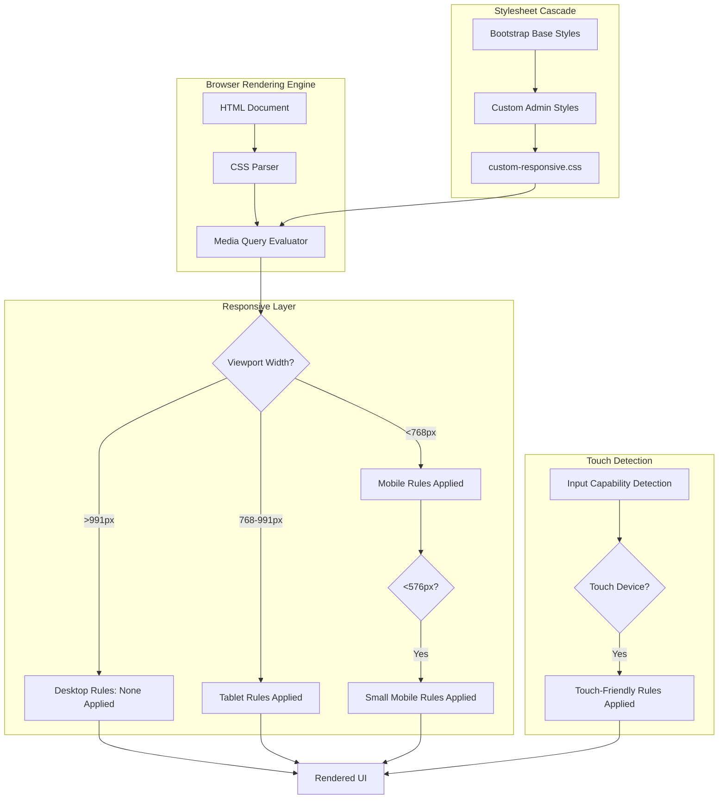

# Design Document: Admin Panel Responsive Improvements

## Overview

The Admin Panel Responsive Improvements feature transforms the existing desktop-only admin interface into a fully responsive web application that adapts seamlessly to mobile and tablet devices. This design implements a CSS-only solution using media queries and responsive design patterns to ensure administrators can effectively manage the system from any device.

### Design Philosophy

The design follows a **progressive enhancement** approach:
- Desktop experience (>991px) remains completely unchanged to preserve existing workflows
- Tablet devices (768-991px) receive optimized 2-column layouts
- Mobile devices (<768px) receive single-column layouts with touch-friendly interactions
- Small mobile devices (<576px) receive additional compaction for efficient space usage

### Key Design Principles

1. **CSS-Only Implementation**: No JavaScript modifications required, ensuring maintainability and performance
2. **Bootstrap Compatibility**: Maintains full compatibility with the existing Bootstrap grid system
3. **Touch-First Mobile**: All interactive elements meet 44px minimum touch target requirements
4. **Content Priority**: Important information remains visible; less critical columns hide on mobile
5. **No Horizontal Scroll**: All layouts adapt to viewport width without requiring horizontal scrolling

### Technical Approach

The implementation uses CSS media queries to apply responsive rules at specific breakpoints:
- **Tablet breakpoint**: `@media (max-width: 991px)`
- **Mobile breakpoint**: `@media (max-width: 767px)`
- **Small mobile breakpoint**: `@media (max-width: 575px)`
- **Touch device detection**: `@media (hover: none) and (pointer: coarse)`
- **Landscape optimization**: `@media (max-height: 768px) and (orientation: landscape)`

## Architecture

### System Architecture



### Responsive Breakpoint System

The design implements a four-tier breakpoint system:

| Breakpoint | Range | Target Devices | Layout Strategy |
|------------|-------|----------------|-----------------|
| Desktop | >991px | Desktop computers, large tablets | Original layout unchanged |
| Tablet | 768-991px | iPad, Android tablets | 2-column grid, reduced spacing |
| Mobile | <768px | Smartphones | Single-column, touch-optimized |
| Small Mobile | <576px | Small smartphones | Maximum compaction |

### CSS Cascade Strategy

The responsive stylesheet follows a specific loading order to ensure proper rule application:

1. **Bootstrap Framework** (base styles)
2. **Custom Admin Styles** (desktop-first styles)
3. **custom-responsive.css** (responsive overrides)

This cascade ensures that responsive rules only override what's necessary while preserving the base functionality.

## Components and Interfaces

### Component Hierarchy

The admin panel consists of several major component categories, each requiring specific responsive adaptations:

#### 1. Navigation Components

**Navbar Component**
- **Desktop**: Full-width search (260px), GitHub button visible, 40px avatar
- **Tablet**: Reduced search width (180px), GitHub button visible, 40px avatar
- **Mobile**: Flexible search (100%, max 300px), GitHub button hidden, 32px avatar

**Sidebar Component**
- **Desktop**: Fixed 260px width, always visible
- **Tablet**: Fixed 260px width, collapsible
- **Mobile**: Off-canvas overlay, hidden by default

#### 2. Layout Components

**Container Component**
```css
/* Desktop: Bootstrap default padding */
.container-xxl { padding: 0 1.5rem; }

/* Mobile: Reduced padding */
@media (max-width: 767px) {
  .container-xxl { padding: 0 12px; }
}

/* Small Mobile: Minimal padding */
@media (max-width: 575px) {
  .container-xxl { padding: 0 8px; }
}
```

**Grid System Adaptation**
- **Desktop**: 4-column grid for dashboard cards
- **Tablet**: 2-column grid (50% width per card)
- **Mobile**: 1-column grid (100% width per card)

#### 3. Data Display Components

**Dashboard Card Component**

Responsive behavior:
- Width: Desktop (25%) → Tablet (50%) → Mobile (100%)
- Padding: Desktop (1.5rem) → Mobile (1rem) → Small Mobile (0.75rem)
- Chart heights: Scaled down proportionally on mobile

**Data Table Component**

Mobile adaptation strategy:
- Remove minimum width constraints
- Hide non-essential columns (SKU, Qty)
- Increase product image size (48px) for better visibility
- Truncate long text with ellipsis
- Ensure action buttons meet 44px touch target minimum

**Stat Card Component**

Responsive scaling:
- Icon size: Desktop (48px) → Mobile (40px) → Small Mobile (36px)
- Value font: Desktop (2rem) → Mobile (1.5rem) → Small Mobile (1.375rem)
- Padding: Desktop (1.5rem) → Mobile (1rem) → Small Mobile (0.875rem)

**Ready to Ship Styles Component**

The Ready to Ship Styles section displays product style collections in a grid card layout.

Desktop layout structure:
```
┌─────────────────────────────────────────────┐
│  ┌──────────┐  ┌────────┬────────┐         │
│  │          │  │ Card 2 │ Card 3 │         │
│  │  Large   │  ├────────┼────────┤         │
│  │  Card 1  │  │ Card 4 │ Card 5 │         │
│  │          │  └────────┴────────┘         │
│  └──────────┘                               │
└─────────────────────────────────────────────┘
```

Responsive behavior:
- **Desktop (>991px)**: Grid layout with one large card (50% width) on left, 2x2 grid of smaller cards (25% width each) on right
- **Tablet (768-991px)**: 2-column layout with cards stacking vertically
- **Mobile (<768px)**: Single-column layout with all cards at 100% width

CSS implementation:
```css
/* Desktop: Grid layout */
.ready-to-ship-styles {
  display: grid;
  grid-template-columns: 1fr 1fr;
  gap: 1.5rem;
}

.ready-to-ship-styles .large-card {
  grid-row: 1 / 3;
  grid-column: 1;
}

.ready-to-ship-styles .small-cards {
  display: grid;
  grid-template-columns: 1fr 1fr;
  grid-template-rows: 1fr 1fr;
  gap: 1.5rem;
  grid-column: 2;
}

/* Tablet: 2-column layout */
@media (max-width: 991px) {
  .ready-to-ship-styles {
    grid-template-columns: 1fr 1fr;
  }
  
  .ready-to-ship-styles .large-card {
    grid-row: auto;
    grid-column: auto;
  }
  
  .ready-to-ship-styles .small-cards {
    grid-template-columns: 1fr;
    grid-column: auto;
  }
}

/* Mobile: Single column */
@media (max-width: 767px) {
  .ready-to-ship-styles {
    grid-template-columns: 1fr;
  }
  
  .ready-to-ship-styles .small-cards {
    grid-template-columns: 1fr;
  }
}
```

Card dimensions:
- Desktop large card: ~50% container width, spans 2 rows
- Desktop small cards: ~25% container width each, 2x2 grid
- Tablet: All cards at 50% width
- Mobile: All cards at 100% width
- Gap spacing: 1.5rem (24px) on desktop, 1rem (16px) on mobile

#### 4. Form Components

**Form Layout Component**

Mobile transformation:
- All columns collapse to 100% width (single-column layout)
- Size checkboxes arrange in 2-column grid (50% each)
- Input groups maintain horizontal layout with compact padding
- Labels reduce to 0.875rem font size
- Textareas set to 100px minimum height

**Input Component**

Touch optimization:
- Minimum height: 44px on touch devices
- Padding: 0.5rem 0.75rem on mobile
- Font size: 0.875rem on mobile

#### 5. Interactive Components

**Button Component**

Responsive behavior:
- Desktop: Inline layout, standard padding
- Mobile: Full-width in button groups, 0.5rem padding
- Touch devices: Minimum 44px height and width

**Modal Dialog Component**

Mobile adaptation:
- Margin: Desktop (1.75rem) → Mobile (0.25rem) → Small Mobile (0.125rem)
- Max width: Desktop (500px) → Mobile (calc(100% - 0.5rem))
- Padding: Desktop (1.5rem) → Mobile (1rem) → Small Mobile (0.75rem)
- Title font: Desktop (1.5rem) → Mobile (1.125rem) → Small Mobile (1rem)

**Dropdown Component**

Mobile behavior:
- Minimum width: 200px
- Touch targets: 44px minimum height
- Item padding: 0.75rem on touch devices

### Interface Contracts

#### CSS Class Interface

The responsive system relies on existing Bootstrap and custom classes:

**Bootstrap Grid Classes**
- `.col-xl-3`, `.col-xl-4`, `.col-lg-6`: Responsive column widths
- `.row-cols-xl-4`, `.row-cols-lg-3`: Responsive row columns
- `.d-flex`, `.justify-content-between`: Flexbox utilities

**Custom Admin Classes**
- `.admin-search-wrapper`: Search bar container
- `.github-button`: GitHub link button
- `.stat-card`: Statistics card component
- `.chart-xs`, `.chart-sm`, `.chart-md`, `.chart-lg`: Chart size variants
- `.ready-to-ship-styles`: Ready to Ship Styles section container
- `.large-card`: Large featured card in Ready to Ship Styles section
- `.small-cards`: Container for 2x2 grid of smaller cards

**Responsive Utility Classes**
- `.hide-mobile`: Hide element on mobile devices
- `.hide-tablet`: Hide element on tablet devices
- `.show-mobile`: Show element only on mobile
- `.show-mobile-flex`: Show as flex on mobile
- `.show-mobile-inline`: Show as inline on mobile

#### Media Query Interface

The system exposes five media query breakpoints:

```css
/* Tablet and below */
@media (max-width: 991px) { /* Tablet rules */ }

/* Mobile and below */
@media (max-width: 767px) { /* Mobile rules */ }

/* Small mobile */
@media (max-width: 575px) { /* Small mobile rules */ }

/* Touch devices */
@media (hover: none) and (pointer: coarse) { /* Touch rules */ }

/* Landscape mobile */
@media (max-height: 768px) and (orientation: landscape) { /* Landscape rules */ }
```

## Data Models

### Viewport State Model

The responsive system operates on an implicit viewport state model:

```typescript
interface ViewportState {
  width: number;           // Current viewport width in pixels
  height: number;          // Current viewport height in pixels
  deviceType: 'desktop' | 'tablet' | 'mobile' | 'small-mobile';
  orientation: 'portrait' | 'landscape';
  inputCapability: {
    hasHover: boolean;     // Can user hover (mouse/trackpad)
    pointerType: 'fine' | 'coarse';  // Fine (mouse) or coarse (touch)
  };
}
```

**State Transitions**

The viewport state changes when:
1. User resizes browser window
2. User rotates device (orientation change)
3. User switches between devices

The CSS media queries automatically re-evaluate and apply appropriate rules on state changes.

### Responsive Rule Model

Each responsive rule follows this conceptual model:

```typescript
interface ResponsiveRule {
  selector: string;        // CSS selector (e.g., ".navbar")
  breakpoint: Breakpoint;  // Which breakpoint this applies to
  properties: {
    [key: string]: string; // CSS properties to override
  };
  priority: number;        // Specificity/importance
}

type Breakpoint = 
  | { type: 'tablet', maxWidth: 991 }
  | { type: 'mobile', maxWidth: 767 }
  | { type: 'small-mobile', maxWidth: 575 }
  | { type: 'touch', hover: 'none', pointer: 'coarse' }
  | { type: 'landscape', maxHeight: 768, orientation: 'landscape' };
```

### Component Dimension Model

Each component has dimension specifications for each breakpoint:

```typescript
interface ComponentDimensions {
  desktop: {
    width?: string;
    height?: string;
    padding?: string;
    fontSize?: string;
  };
  tablet: {
    width?: string;
    height?: string;
    padding?: string;
    fontSize?: string;
  };
  mobile: {
    width?: string;
    height?: string;
    padding?: string;
    fontSize?: string;
  };
  smallMobile: {
    width?: string;
    height?: string;
    padding?: string;
    fontSize?: string;
  };
}
```

**Example: Navbar Search Component**

```typescript
const navbarSearchDimensions: ComponentDimensions = {
  desktop: { width: '260px' },
  tablet: { width: '180px' },
  mobile: { width: '100%', maxWidth: '300px' },
  smallMobile: { width: '100%', maxWidth: '250px' }
};
```

### Touch Target Model

Touch-friendly components must meet minimum size requirements:

```typescript
interface TouchTarget {
  minWidth: '44px';   // WCAG 2.1 Level AAA guideline
  minHeight: '44px';  // WCAG 2.1 Level AAA guideline
  padding: string;    // Additional padding for comfort
}

// Applied to: buttons, checkboxes, dropdown toggles, links
```

### Typography Scale Model

Font sizes scale proportionally across breakpoints:

```typescript
interface TypographyScale {
  pageTitle: {
    desktop: '1.5rem';      // 24px
    mobile: '1.25rem';      // 20px
    smallMobile: '1.125rem'; // 18px
  };
  cardHeader: {
    desktop: '1.25rem';     // 20px
    mobile: '1rem';         // 16px
  };
  bodyText: {
    desktop: '1rem';        // 16px
    mobile: '0.875rem';     // 14px
    smallMobile: '0.813rem'; // 13px
  };
  smallText: {
    desktop: '0.875rem';    // 14px
    mobile: '0.813rem';     // 13px
    smallMobile: '0.75rem';  // 12px
  };
}
```

### Spacing Scale Model

Spacing values reduce on smaller screens:

```typescript
interface SpacingScale {
  containerPadding: {
    desktop: '1.5rem';   // 24px (Bootstrap default)
    mobile: '12px';      // 12px
    smallMobile: '8px';  // 8px
  };
  cardPadding: {
    desktop: '1.5rem';   // 24px
    mobile: '1rem';      // 16px
    smallMobile: '0.75rem'; // 12px
  };
  elementMargin: {
    desktop: '1.5rem';   // 24px
    mobile: '1rem';      // 16px
    smallMobile: '0.75rem'; // 12px
  };
}
```

### Ready to Ship Styles Layout Model

The Ready to Ship Styles section uses CSS Grid for responsive card layouts:

```typescript
interface ReadyToShipStylesLayout {
  desktop: {
    display: 'grid';
    gridTemplateColumns: '1fr 1fr';
    gap: '1.5rem';
    largeCard: {
      gridRow: '1 / 3';
      gridColumn: '1';
      width: '~50%';  // Approximately 50% of container
    };
    smallCardsContainer: {
      display: 'grid';
      gridTemplateColumns: '1fr 1fr';
      gridTemplateRows: '1fr 1fr';
      gap: '1.5rem';
      gridColumn: '2';
    };
    smallCard: {
      width: '~25%';  // Approximately 25% of container each
    };
  };
  tablet: {
    display: 'grid';
    gridTemplateColumns: '1fr 1fr';
    gap: '1rem';
    largeCard: {
      gridRow: 'auto';
      gridColumn: 'auto';
      width: '50%';
    };
    smallCardsContainer: {
      gridTemplateColumns: '1fr';
      gridColumn: 'auto';
    };
    smallCard: {
      width: '50%';
    };
  };
  mobile: {
    display: 'grid';
    gridTemplateColumns: '1fr';
    gap: '1rem';
    largeCard: {
      width: '100%';
    };
    smallCardsContainer: {
      gridTemplateColumns: '1fr';
    };
    smallCard: {
      width: '100%';
    };
  };
}
```

**Layout Behavior:**
- Desktop: Large card spans 2 rows on left (50% width), 4 small cards in 2x2 grid on right (25% width each)
- Tablet: 2-column layout with cards stacking vertically (50% width each)
- Mobile: Single-column layout (100% width each)
- Gap spacing: 1.5rem on desktop, 1rem on tablet/mobile


## Correctness Properties

*A property is a characteristic or behavior that should hold true across all valid executions of a system—essentially, a formal statement about what the system should do. Properties serve as the bridge between human-readable specifications and machine-verifiable correctness guarantees.*

### Property Reflection

After analyzing all acceptance criteria, I identified the following testable properties and examples:

**Properties (universal rules):**
- Desktop view preservation (1.1)
- Touch target minimum size (10.3)
- Bootstrap grid compatibility (12.3)

**Examples (specific test cases):**
- All other acceptance criteria are specific examples of CSS rules at specific breakpoints
- These include: navbar dimensions, card layouts, table adaptations, form layouts, etc.

**Redundancies eliminated:**
- 1.2 and 1.3 are redundant with 1.1 (desktop preservation)
- 12.2 is redundant with 12.1 (CSS-only implementation)
- 11.5 is redundant with 5.4 (form label styling)

**Not testable via unit/property tests:**
- 6.4, 11.3, 11.4: Vague requirements without specific values
- 14.1-14.5: Browser compatibility requires manual or E2E testing

The majority of requirements are specific examples of CSS behavior at specific breakpoints, which are best tested through visual regression testing or E2E tests rather than property-based tests. However, we can define a few key properties that should hold universally.

### Property 1: Desktop View Preservation

*For any* viewport width greater than 991px, no responsive CSS rules from custom-responsive.css should override the original desktop styling, ensuring all components maintain their original dimensions, spacing, and layout.

**Validates: Requirements 1.1, 1.2, 1.3**

**Rationale**: This is the most critical property of the design. The desktop experience must remain completely unchanged. This can be tested by verifying that at desktop viewport widths, computed styles match the original styles before the responsive CSS was added.

### Property 2: Touch Target Accessibility

*For any* interactive element (buttons, links, form inputs, checkboxes, dropdown toggles) on touch devices, the minimum tappable area should be at least 44px × 44px to meet WCAG 2.1 Level AAA guidelines.

**Validates: Requirements 10.3, 4.6**

**Rationale**: Touch accessibility is a universal requirement that must hold for all interactive elements. This ensures users can reliably interact with the interface on touch devices without frustration.

### Property 3: Bootstrap Grid Compatibility

*For any* Bootstrap grid class (`.col-*`, `.row`, `.container-*`), the responsive CSS should not break the Bootstrap grid system's expected behavior, ensuring that grid layouts continue to function correctly at all breakpoints.

**Validates: Requirements 12.3**

**Rationale**: The responsive implementation must work harmoniously with Bootstrap. Breaking the grid system would cause layout failures throughout the application.

### Property 4: No Horizontal Scroll

*For any* viewport width at mobile or tablet breakpoints, no content should extend beyond the viewport width, ensuring users never need to scroll horizontally to access content or functionality.

**Validates: Requirements 2.2, 2.3, 2.4, 4.1, 7.2**

**Rationale**: Horizontal scrolling is a critical usability failure on mobile devices. This property ensures all content adapts to fit within the viewport width.

### Example Test Cases

The following are specific examples that should be verified through unit tests or visual regression tests:

**Navbar Responsive Behavior:**
- Desktop (>991px): Search bar 260px width, GitHub button visible, avatar 40px
- Tablet (768-991px): Search bar 180px width, GitHub button visible, avatar 40px
- Mobile (<768px): Search bar 100% width (max 300px), GitHub button hidden, avatar 32px

**Dashboard Card Layout:**
- Desktop: 4-column grid (25% width each)
- Tablet: 2-column grid (50% width each)
- Mobile: 1-column grid (100% width each)

**Chart Component Heights (Mobile):**
- `.chart-xs`: 60px
- `.chart-sm`: 80px
- `.chart-md`: 150px
- `.chart-lg`: 200px

**Data Table Mobile Adaptations:**
- Remove minimum width constraints
- Hide SKU column (4th column)
- Hide Qty column (6th column)
- Product images: 48px size
- Product names: truncate at 150px with ellipsis
- Action buttons: minimum 44px height

**Form Layout Mobile Behavior:**
- All form columns: 100% width (single-column)
- Size checkboxes: 2-column layout (50% each)
- Form labels: 0.875rem font size
- Textareas: 100px minimum height

**Stat Card Responsive Sizing:**
- Mobile: 1rem padding, 40px icons, 0.813rem labels
- Small Mobile: 0.875rem padding, 36px icons, 0.75rem labels

**Ready to Ship Styles Layout:**
- Desktop (>991px): Grid layout with large card (50% width, spans 2 rows) on left, 2x2 grid of small cards (25% width each) on right, 1.5rem gap
- Tablet (768-991px): 2-column layout (50% width each), 1rem gap
- Mobile (<768px): Single-column layout (100% width), 1rem gap
- Large card: `grid-row: 1 / 3; grid-column: 1` on desktop
- Small cards container: `grid-template-columns: 1fr 1fr; grid-template-rows: 1fr 1fr` on desktop
- CSS Grid display property applied to `.ready-to-ship-styles` container

**Modal Dialog Responsive Sizing:**
- Mobile: 0.25rem margins, calc(100% - 0.5rem) max-width, 1rem padding, 1.125rem title
- Small Mobile: 0.125rem margins, 1rem title

**Container Padding:**
- Desktop: 1.5rem (Bootstrap default)
- Mobile: 12px
- Small Mobile: 8px

**Media Query Breakpoints:**
- Tablet: `@media (max-width: 991px)`
- Mobile: `@media (max-width: 767px)`
- Small Mobile: `@media (max-width: 575px)`
- Touch: `@media (hover: none) and (pointer: coarse)`
- Landscape: `@media (max-height: 768px) and (orientation: landscape)`

**Implementation Constraints:**
- CSS-only implementation (no JavaScript modifications)
- Single stylesheet: `Hub/static/admin/assets/css/custom-responsive.css`

## Error Handling

### CSS Error Handling

CSS is fault-tolerant by design. Invalid CSS rules are ignored by the browser without breaking the page. However, the design includes several defensive strategies:

#### 1. Graceful Degradation

If a browser doesn't support a specific CSS feature, the design degrades gracefully:

```css
/* Fallback for browsers without calc() support */
.modal-dialog {
  max-width: 95%; /* Fallback */
  max-width: calc(100% - 0.5rem); /* Modern browsers */
}
```

#### 2. Vendor Prefix Strategy

For touch scrolling, vendor prefixes ensure compatibility:

```css
.table-responsive {
  overflow-x: auto;
  -webkit-overflow-scrolling: touch; /* iOS Safari */
}
```

#### 3. Important Flag Usage

The `!important` flag is used sparingly and only when necessary to override Bootstrap's specificity:

```css
/* Override Bootstrap's default sidebar width on tablet */
@media (max-width: 991px) {
  .layout-menu {
    width: 260px !important;
  }
}
```

**Important Flag Guidelines:**
- Use only when overriding third-party framework styles (Bootstrap)
- Document why `!important` is necessary
- Avoid in custom component styles

#### 4. Media Query Fallbacks

Browsers that don't support specific media query features will ignore those rules:

```css
/* Touch detection - ignored by browsers without support */
@media (hover: none) and (pointer: coarse) {
  /* Touch-specific rules */
}
```

### Edge Cases

#### 1. Very Small Viewports (<320px)

While the design targets 576px as the small mobile breakpoint, devices smaller than 320px may experience layout issues. The design handles this by:
- Using percentage-based widths rather than fixed pixels where possible
- Allowing text to wrap naturally
- Accepting that some content may be cramped on extremely small devices

#### 2. Very Large Viewports (>1920px)

Desktop view is unchanged, so very large viewports will display the original desktop layout. Bootstrap's container classes handle maximum widths appropriately.

#### 3. Unusual Aspect Ratios

The landscape media query handles wide, short viewports:

```css
@media (max-height: 768px) and (orientation: landscape) {
  /* Reduce vertical spacing */
}
```

#### 4. Browser Zoom

When users zoom the page:
- Media queries respond to the zoomed viewport size
- A desktop user zooming to 200% may trigger mobile breakpoints
- This is expected behavior and provides accessibility benefits

#### 5. Print Styles

The responsive CSS doesn't include print styles. If print support is needed, a separate print stylesheet should be added:

```html
<link rel="stylesheet" href="print.css" media="print">
```

### Browser Compatibility Issues

#### 1. CSS Grid Support

The design uses Flexbox and Bootstrap's grid system, which have excellent browser support. CSS Grid is not used to maintain compatibility with older browsers.

#### 2. Media Query Support

All modern browsers support the media queries used:
- `max-width`, `max-height`: Universal support
- `hover: none` and `pointer: coarse`: Supported in all modern browsers (Chrome 41+, Firefox 64+, Safari 9+)

#### 3. Calc() Function

The `calc()` function is used for modal widths and has universal support in modern browsers.

#### 4. Viewport Units

Viewport units (vw, vh) are avoided in favor of percentages to prevent issues with mobile browser chrome (address bar, toolbars).

## Testing Strategy

### Dual Testing Approach

The responsive design requires both **unit tests** and **visual regression tests** for comprehensive coverage:

**Unit Tests**: Verify CSS rule application and computed styles
**Visual Regression Tests**: Verify actual rendered appearance across devices

### Unit Testing

Unit tests focus on verifying that CSS rules are correctly applied at different breakpoints.

#### Testing Framework

For CSS testing, we'll use **Jest** with **jsdom** to simulate different viewport sizes and test computed styles.

**Setup:**
```javascript
// test-utils/viewport.js
export function setViewport(width, height) {
  global.innerWidth = width;
  global.innerHeight = height;
  window.dispatchEvent(new Event('resize'));
}

export function getComputedStyle(element, property) {
  return window.getComputedStyle(element).getPropertyValue(property);
}
```

#### Property-Based Testing

For the universal properties identified, we'll use **fast-check** (JavaScript property-based testing library) to generate random test cases.

**Configuration:**
- Minimum 100 iterations per property test
- Each test tagged with feature name and property number

**Property Test 1: Desktop View Preservation**

```javascript
/**
 * Feature: admin-panel-responsive-improvements
 * Property 1: For any viewport width greater than 991px, no responsive CSS rules 
 * should override the original desktop styling
 */
import fc from 'fast-check';

describe('Property 1: Desktop View Preservation', () => {
  it('should not apply responsive rules at desktop widths', () => {
    fc.assert(
      fc.property(
        fc.integer({ min: 992, max: 3840 }), // Desktop viewport widths
        (viewportWidth) => {
          setViewport(viewportWidth, 1080);
          
          // Test key elements maintain desktop styling
          const searchBar = document.querySelector('.admin-search-wrapper');
          const avatar = document.querySelector('.avatar');
          const githubButton = document.querySelector('.github-button');
          
          // Search bar should be 260px on desktop
          expect(getComputedStyle(searchBar, 'width')).toBe('260px');
          
          // Avatar should be 40px on desktop
          expect(getComputedStyle(avatar, 'width')).toBe('40px');
          
          // GitHub button should be visible
          expect(getComputedStyle(githubButton, 'display')).not.toBe('none');
          
          return true;
        }
      ),
      { numRuns: 100 }
    );
  });
});
```

**Property Test 2: Touch Target Accessibility**

```javascript
/**
 * Feature: admin-panel-responsive-improvements
 * Property 2: For any interactive element on touch devices, the minimum tappable 
 * area should be at least 44px × 44px
 */
describe('Property 2: Touch Target Accessibility', () => {
  it('should ensure all interactive elements meet 44px minimum on touch devices', () => {
    fc.assert(
      fc.property(
        fc.constantFrom('button', 'a', 'input[type="checkbox"]', '.dropdown-toggle'),
        (selector) => {
          // Simulate touch device
          setViewport(375, 667); // iPhone size
          document.documentElement.style.setProperty('--hover', 'none');
          document.documentElement.style.setProperty('--pointer', 'coarse');
          
          const elements = document.querySelectorAll(selector);
          
          return Array.from(elements).every(element => {
            const height = parseInt(getComputedStyle(element, 'height'));
            const width = parseInt(getComputedStyle(element, 'width'));
            const minHeight = parseInt(getComputedStyle(element, 'min-height'));
            const minWidth = parseInt(getComputedStyle(element, 'min-width'));
            
            return (height >= 44 || minHeight >= 44) && 
                   (width >= 44 || minWidth >= 44);
          });
        }
      ),
      { numRuns: 100 }
    );
  });
});
```

**Property Test 3: Bootstrap Grid Compatibility**

```javascript
/**
 * Feature: admin-panel-responsive-improvements
 * Property 3: For any Bootstrap grid class, the responsive CSS should not break 
 * the Bootstrap grid system's expected behavior
 */
describe('Property 3: Bootstrap Grid Compatibility', () => {
  it('should maintain Bootstrap grid behavior at all breakpoints', () => {
    fc.assert(
      fc.property(
        fc.integer({ min: 320, max: 1920 }), // All viewport widths
        fc.constantFrom('col-12', 'col-md-6', 'col-lg-4', 'col-xl-3'),
        (viewportWidth, colClass) => {
          setViewport(viewportWidth, 1080);
          
          const element = document.createElement('div');
          element.className = colClass;
          document.body.appendChild(element);
          
          // Bootstrap columns should have proper flex properties
          const display = getComputedStyle(element, 'display');
          const flexBasis = getComputedStyle(element, 'flex-basis');
          
          // Clean up
          document.body.removeChild(element);
          
          // Verify Bootstrap grid properties are intact
          return display === 'block' || display === 'flex';
        }
      ),
      { numRuns: 100 }
    );
  });
});
```

**Property Test 4: No Horizontal Scroll**

```javascript
/**
 * Feature: admin-panel-responsive-improvements
 * Property 4: For any viewport width at mobile or tablet breakpoints, no content 
 * should extend beyond the viewport width
 */
describe('Property 4: No Horizontal Scroll', () => {
  it('should prevent horizontal scrolling at mobile and tablet breakpoints', () => {
    fc.assert(
      fc.property(
        fc.integer({ min: 320, max: 991 }), // Mobile and tablet widths
        (viewportWidth) => {
          setViewport(viewportWidth, 1080);
          
          // Check that body width doesn't exceed viewport
          const bodyWidth = document.body.scrollWidth;
          const viewportWidth = window.innerWidth;
          
          // Check that no elements overflow
          const allElements = document.querySelectorAll('*');
          const overflowingElements = Array.from(allElements).filter(el => {
            const rect = el.getBoundingClientRect();
            return rect.right > viewportWidth;
          });
          
          return bodyWidth <= viewportWidth && overflowingElements.length === 0;
        }
      ),
      { numRuns: 100 }
    );
  });
});
```

### Example-Based Unit Tests

For specific CSS rules at specific breakpoints, we'll write example-based unit tests:

```javascript
describe('Navbar Responsive Behavior', () => {
  it('should hide GitHub button on mobile', () => {
    setViewport(375, 667); // Mobile
    const githubButton = document.querySelector('.github-button');
    expect(getComputedStyle(githubButton, 'display')).toBe('none');
  });
  
  it('should set search bar to 180px on tablet', () => {
    setViewport(800, 1024); // Tablet
    const searchBar = document.querySelector('.admin-search-wrapper');
    expect(getComputedStyle(searchBar, 'width')).toBe('180px');
  });
  
  it('should set avatar to 32px on mobile', () => {
    setViewport(375, 667); // Mobile
    const avatar = document.querySelector('.avatar');
    expect(getComputedStyle(avatar, 'width')).toBe('32px');
  });
});

describe('Dashboard Card Layout', () => {
  it('should arrange cards in 2 columns on tablet', () => {
    setViewport(800, 1024); // Tablet
    const card = document.querySelector('.col-xl-3');
    expect(getComputedStyle(card, 'width')).toBe('50%');
  });
  
  it('should arrange cards in 1 column on mobile', () => {
    setViewport(375, 667); // Mobile
    const card = document.querySelector('.col-xl-3');
    expect(getComputedStyle(card, 'width')).toBe('100%');
  });
});

describe('Ready to Ship Styles Layout', () => {
  it('should use grid layout with large card and 2x2 small cards on desktop', () => {
    setViewport(1920, 1080); // Desktop
    const container = document.querySelector('.ready-to-ship-styles');
    const largeCard = document.querySelector('.ready-to-ship-styles .large-card');
    const smallCardsContainer = document.querySelector('.ready-to-ship-styles .small-cards');
    
    expect(getComputedStyle(container, 'display')).toBe('grid');
    expect(getComputedStyle(container, 'grid-template-columns')).toBe('1fr 1fr');
    expect(getComputedStyle(container, 'gap')).toBe('1.5rem');
    
    expect(getComputedStyle(largeCard, 'grid-row')).toBe('1 / 3');
    expect(getComputedStyle(largeCard, 'grid-column')).toBe('1');
    
    expect(getComputedStyle(smallCardsContainer, 'display')).toBe('grid');
    expect(getComputedStyle(smallCardsContainer, 'grid-template-columns')).toBe('1fr 1fr');
    expect(getComputedStyle(smallCardsContainer, 'grid-template-rows')).toBe('1fr 1fr');
  });
  
  it('should arrange cards in 2-column layout on tablet', () => {
    setViewport(800, 1024); // Tablet
    const container = document.querySelector('.ready-to-ship-styles');
    const largeCard = document.querySelector('.ready-to-ship-styles .large-card');
    const smallCardsContainer = document.querySelector('.ready-to-ship-styles .small-cards');
    
    expect(getComputedStyle(container, 'grid-template-columns')).toBe('1fr 1fr');
    expect(getComputedStyle(container, 'gap')).toBe('1rem');
    expect(getComputedStyle(largeCard, 'grid-row')).toBe('auto');
    expect(getComputedStyle(smallCardsContainer, 'grid-template-columns')).toBe('1fr');
  });
  
  it('should arrange cards in single column on mobile', () => {
    setViewport(375, 667); // Mobile
    const container = document.querySelector('.ready-to-ship-styles');
    const smallCardsContainer = document.querySelector('.ready-to-ship-styles .small-cards');
    
    expect(getComputedStyle(container, 'grid-template-columns')).toBe('1fr');
    expect(getComputedStyle(container, 'gap')).toBe('1rem');
    expect(getComputedStyle(smallCardsContainer, 'grid-template-columns')).toBe('1fr');
  });
});

describe('Chart Component Heights', () => {
  it('should set chart-xs to 60px on mobile', () => {
    setViewport(375, 667); // Mobile
    const chart = document.querySelector('.chart-xs');
    expect(getComputedStyle(chart, 'min-height')).toBe('60px');
  });
  
  it('should set chart-sm to 80px on mobile', () => {
    setViewport(375, 667); // Mobile
    const chart = document.querySelector('.chart-sm');
    expect(getComputedStyle(chart, 'min-height')).toBe('80px');
  });
});

describe('Media Query Breakpoints', () => {
  it('should use correct tablet breakpoint', () => {
    const css = fs.readFileSync('Hub/static/admin/assets/css/custom-responsive.css', 'utf8');
    expect(css).toContain('@media (max-width: 991px)');
  });
  
  it('should use correct mobile breakpoint', () => {
    const css = fs.readFileSync('Hub/static/admin/assets/css/custom-responsive.css', 'utf8');
    expect(css).toContain('@media (max-width: 767px)');
  });
  
  it('should use correct small mobile breakpoint', () => {
    const css = fs.readFileSync('Hub/static/admin/assets/css/custom-responsive.css', 'utf8');
    expect(css).toContain('@media (max-width: 575px)');
  });
});

describe('CSS-Only Implementation', () => {
  it('should contain all responsive rules in single CSS file', () => {
    const cssPath = 'Hub/static/admin/assets/css/custom-responsive.css';
    expect(fs.existsSync(cssPath)).toBe(true);
  });
  
  it('should not require JavaScript modifications', () => {
    // Verify no JS files were modified for responsive behavior
    const jsFiles = glob.sync('Hub/static/admin/assets/js/**/*.js');
    jsFiles.forEach(file => {
      const content = fs.readFileSync(file, 'utf8');
      expect(content).not.toContain('responsive');
      expect(content).not.toContain('media query');
    });
  });
});
```

### Visual Regression Testing

Visual regression tests capture screenshots at different viewport sizes and compare them to baseline images.

**Tool**: **Percy** or **BackstopJS**

**Test Scenarios:**
1. Dashboard page at desktop, tablet, mobile, small mobile
2. Product list page at desktop, tablet, mobile
3. Product form page at desktop, tablet, mobile
4. Order list page at desktop, tablet, mobile
5. Modal dialogs at desktop, tablet, mobile
6. Navigation bar at desktop, tablet, mobile
7. Footer at desktop, tablet, mobile
8. Ready to Ship Styles section at desktop, tablet, mobile

**Viewport Sizes to Test:**
- Desktop: 1920×1080, 1366×768
- Tablet: 1024×768, 768×1024 (portrait)
- Mobile: 375×667 (iPhone), 414×896 (iPhone Plus), 360×640 (Android)
- Small Mobile: 320×568 (iPhone SE)

### Manual Testing Checklist

Some aspects require manual testing:

**Browser Compatibility:**
- [ ] Chrome (latest) - Desktop, Android
- [ ] Firefox (latest) - Desktop
- [ ] Safari (latest) - Desktop, iOS
- [ ] Edge (latest) - Desktop

**Device Testing:**
- [ ] iPhone (Safari)
- [ ] iPad (Safari)
- [ ] Android phone (Chrome)
- [ ] Android tablet (Chrome)

**Interaction Testing:**
- [ ] Touch targets are easily tappable
- [ ] No horizontal scrolling on any page
- [ ] Forms are usable on mobile
- [ ] Tables display correctly on mobile
- [ ] Modals fit on screen
- [ ] Dropdowns work on touch devices

**Orientation Testing:**
- [ ] Portrait mode works correctly
- [ ] Landscape mode works correctly
- [ ] Orientation changes don't break layout

### Test Coverage Goals

- **Property-based tests**: 4 properties, 100 iterations each = 400 test cases
- **Example-based unit tests**: ~50 specific CSS rule tests
- **Visual regression tests**: 7 pages × 7 viewports = 49 screenshot comparisons
- **Manual testing**: 4 browsers × 4 devices = 16 manual test sessions

### Continuous Integration

Tests should run on every pull request:

```yaml
# .github/workflows/responsive-tests.yml
name: Responsive CSS Tests

on: [pull_request]

jobs:
  test:
    runs-on: ubuntu-latest
    steps:
      - uses: actions/checkout@v2
      - name: Setup Node
        uses: actions/setup-node@v2
        with:
          node-version: '18'
      - name: Install dependencies
        run: npm install
      - name: Run unit tests
        run: npm test -- --coverage
      - name: Run visual regression tests
        run: npm run test:visual
```

### Test Maintenance

- Update baseline screenshots when intentional design changes are made
- Review and update property tests if new interactive components are added
- Add new example tests when new responsive rules are added
- Re-run manual tests on major browser updates

