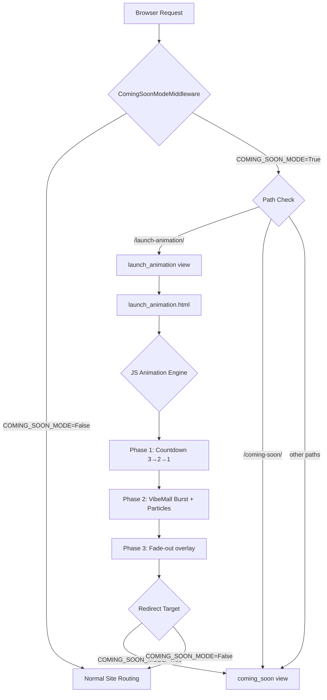
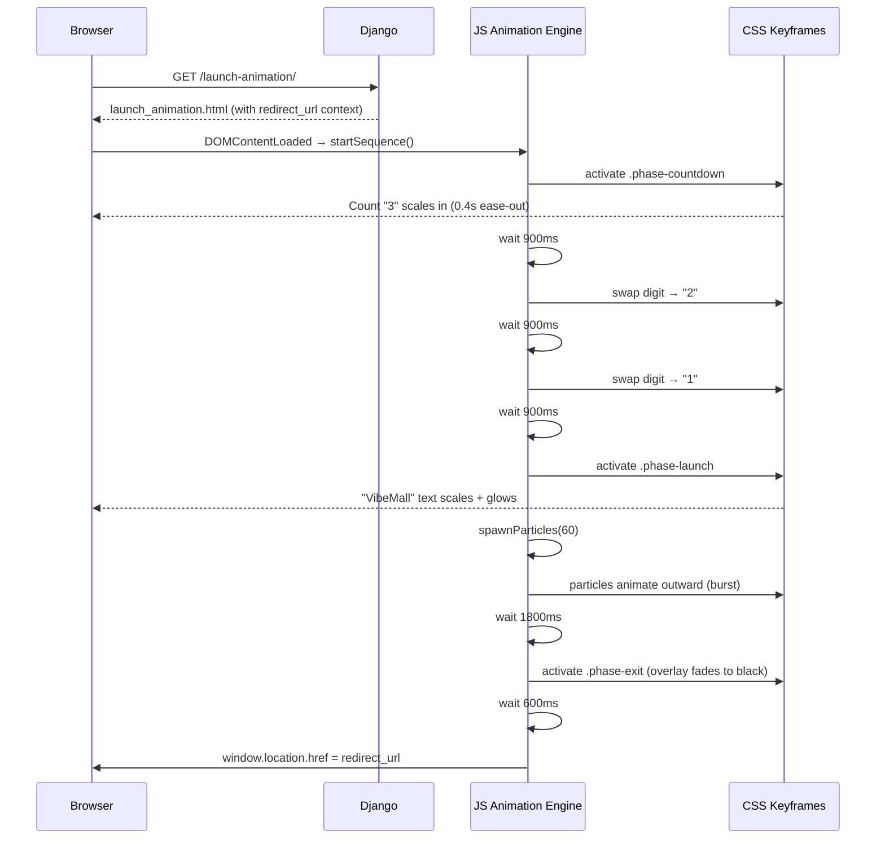

# Design Document: Launch Animation Page

## Overview

When a visitor hits VibeMall while `COMING_SOON_MODE=True`, instead of landing directly on the static coming-soon page they are routed through a fullscreen launch animation sequence: a 3→2→1 countdown with dramatic animated numerals, followed by a "VibeMall" burst/explosion reveal, then a smooth transition that redirects to the actual site (or the coming-soon page if the site is still locked). The animation is self-contained — pure CSS keyframes + vanilla JS, no external animation libraries — and matches VibeMall's gold/dark aesthetic (`#b88b4a`, `#8e6730`, `#fffdf8`, `#171818`).

The feature adds one new Django view (`launch_animation`), one new template (`launch_animation.html`), one new URL entry, and a small middleware update so that the animation URL is whitelisted. No new models or database changes are required.

---

## Architecture



---

## Sequence Diagrams

### Full Animation Flow



---

## Components and Interfaces

### Component 1: `launch_animation` Django View

**Purpose**: Renders the animation template and injects the post-animation redirect URL.

**Interface** (Python):
```python
def launch_animation(request: HttpRequest) -> HttpResponse:
    """
    Renders launch_animation.html.
    Context:
      redirect_url (str): URL to navigate to after animation completes.
                          '/' when COMING_SOON_MODE=False, else '/coming-soon/'.
    """
```

**Responsibilities**:
- Determine `redirect_url` from `settings.COMING_SOON_MODE`
- Render `launch_animation.html` with context

---

### Component 2: `launch_animation.html` Template

**Purpose**: Fullscreen standalone page — no `base.html` extension, no header/footer.

**Interface** (Django template variables):
```
{{ redirect_url }}   — string URL injected into a <script> data attribute
```

**Responsibilities**:
- Render fullscreen dark canvas (`#171818` background)
- Host the CSS animation layers (countdown, burst, exit overlay)
- Bootstrap the JS animation engine on `DOMContentLoaded`

---

### Component 3: JS Animation Engine

**Purpose**: Orchestrates the three animation phases in sequence using `setTimeout` chains.

**Interface**:
```javascript
// Entry point — called once on DOMContentLoaded
function startSequence(redirectUrl: string): void

// Internal helpers
function showCountDigit(n: number): void        // swaps digit text + re-triggers CSS animation
function spawnParticles(count: number): void    // creates DOM particle elements
function removeParticles(): void                // cleans up particle DOM nodes
function exitAndRedirect(url: string): void     // triggers exit overlay then redirects
```

**Responsibilities**:
- Drive phase transitions via `setTimeout`
- Spawn/remove particle `<span>` elements dynamically
- Trigger CSS class changes that activate keyframe animations
- Perform final `window.location.href` redirect

---

### Component 4: CSS Animation Layers

**Purpose**: All visual effects — no JS animation values, pure declarative keyframes.

**Layers**:

| Layer | CSS Class | Effect |
|---|---|---|
| Background | `.vm-la-bg` | Radial gold pulse on launch phase |
| Countdown digit | `.vm-la-digit` | Scale-in + fade-out per number |
| Brand text | `.vm-la-brand` | Scale from 0.4 → 1.1 → 1.0 + text-shadow glow |
| Particles | `.vm-la-particle` | Translate outward + fade, randomised via inline CSS vars |
| Exit overlay | `.vm-la-exit` | Full-screen black fade-in |

---

### Component 5: Middleware Update (`ComingSoonModeMiddleware`)

**Purpose**: Whitelist `/launch-animation/` so it is never redirected to `/coming-soon/`.

**Change**: Add `'/launch-animation/'` to `self.allowed_prefixes` tuple.

---

## Data Models

No new database models. The only "data" passed is the `redirect_url` string from view context.

```python
# View context shape
context = {
    "redirect_url": str  # absolute path, e.g. "/" or "/coming-soon/"
}
```

---

## Algorithmic Pseudocode

### Main Animation Sequence

```pascal
PROCEDURE startSequence(redirectUrl)
  INPUT: redirectUrl — string URL to navigate to after animation
  OUTPUT: side-effects only (DOM mutations, CSS class changes, navigation)

  SEQUENCE
    // Phase 1 — Countdown
    FOR digit IN [3, 2, 1] DO
      showCountDigit(digit)
      WAIT 900ms
    END FOR

    // Phase 2 — Launch burst
    hideCoundownLayer()
    showLaunchLayer()
    spawnParticles(60)
    WAIT 1800ms

    // Phase 3 — Exit
    removeParticles()
    exitAndRedirect(redirectUrl)
  END SEQUENCE
END PROCEDURE
```

**Preconditions:**
- DOM is fully loaded
- `redirectUrl` is a non-empty string
- CSS animation classes are defined

**Postconditions:**
- Browser navigates to `redirectUrl`
- No orphaned particle DOM nodes remain

---

### Particle Spawn Algorithm

```pascal
PROCEDURE spawnParticles(count)
  INPUT: count — integer number of particles to create
  OUTPUT: count particle <span> elements appended to .vm-la-burst container

  SEQUENCE
    container ← document.querySelector('.vm-la-burst')

    FOR i FROM 1 TO count DO
      angle ← RANDOM(0, 360)          // degrees
      distance ← RANDOM(120, 340)     // pixels
      size ← RANDOM(4, 14)            // pixels
      duration ← RANDOM(0.6, 1.4)     // seconds
      delay ← RANDOM(0, 0.3)          // seconds
      hue ← RANDOM(35, 50)            // gold hue range

      particle ← createElement('span')
      particle.className ← 'vm-la-particle'
      SET CSS custom properties on particle:
        --angle: angle + 'deg'
        --dist:  distance + 'px'
        --size:  size + 'px'
        --dur:   duration + 's'
        --delay: delay + 's'
        --hue:   hue

      container.appendChild(particle)
    END FOR
  END SEQUENCE
END PROCEDURE
```

**Preconditions:**
- `.vm-la-burst` container exists in DOM
- `count` > 0

**Postconditions:**
- Exactly `count` `.vm-la-particle` elements exist in `.vm-la-burst`
- Each particle has all required CSS custom properties set

**Loop Invariants:**
- All previously appended particles remain valid DOM nodes throughout iteration

---

### Digit Swap Algorithm

```pascal
PROCEDURE showCountDigit(n)
  INPUT: n — integer (3, 2, or 1)
  OUTPUT: digit element updated and CSS animation re-triggered

  SEQUENCE
    el ← document.querySelector('.vm-la-digit')
    el.textContent ← n

    // Re-trigger CSS animation by removing and re-adding the class
    el.classList.remove('vm-la-digit--animate')
    FORCE_REFLOW(el)   // el.offsetWidth read forces browser reflow
    el.classList.add('vm-la-digit--animate')
  END SEQUENCE
END PROCEDURE
```

**Preconditions:**
- `.vm-la-digit` element exists in DOM
- `n` ∈ {1, 2, 3}

**Postconditions:**
- Element displays `n`
- CSS scale-in animation plays from the beginning

---

## Key Functions with Formal Specifications

### `launch_animation(request)`

**Preconditions:**
- `request` is a valid Django `HttpRequest`
- `settings.COMING_SOON_MODE` is a boolean

**Postconditions:**
- Returns `HttpResponse` with status 200
- Response body contains `redirect_url` embedded in template
- `redirect_url` is `'/'` when `COMING_SOON_MODE=False`, else `'/coming-soon/'`

---

### `startSequence(redirectUrl)`

**Preconditions:**
- `redirectUrl` is a non-empty string
- DOM is ready

**Postconditions:**
- After ~4.2 seconds total, `window.location.href === redirectUrl`
- No memory leaks (all `setTimeout` IDs are clearable; particles removed before redirect)

---

### `spawnParticles(count)`

**Preconditions:**
- `count` is a positive integer
- `.vm-la-burst` container is in DOM

**Postconditions:**
- `.vm-la-burst` contains exactly `count` new child elements with class `vm-la-particle`
- Each particle has CSS vars `--angle`, `--dist`, `--size`, `--dur`, `--delay`, `--hue` set

---

## Example Usage

```python
# Hub/views.py addition
from django.conf import settings

def launch_animation(request):
    redirect_url = '/' if not settings.COMING_SOON_MODE else '/coming-soon/'
    return render(request, 'launch_animation.html', {'redirect_url': redirect_url})
```

```python
# Hub/urls.py addition
path('launch-animation/', views.launch_animation, name='launch_animation'),
```

```python
# Hub/middleware.py — ComingSoonModeMiddleware.__init__ update
self.allowed_prefixes = (
    '/coming-soon/',
    '/launch-animation/',   # ← new
    '/admin-panel/',
    ...
)
```

```html
<!-- launch_animation.html skeleton -->
<!DOCTYPE html>
<html lang="en">
<head>
  <meta charset="UTF-8">
  <title>VibeMall</title>
  <!-- inline CSS: fullscreen dark bg, keyframes for digit/brand/particle/exit -->
</head>
<body>
  <div class="vm-la-bg"></div>
  <div class="vm-la-countdown">
    <span class="vm-la-digit">3</span>
  </div>
  <div class="vm-la-launch" hidden>
    <span class="vm-la-brand">VibeMall</span>
    <div class="vm-la-burst"></div>
  </div>
  <div class="vm-la-exit" hidden></div>

  <script>
    const REDIRECT_URL = "{{ redirect_url }}";
    // startSequence drives all phases
    document.addEventListener('DOMContentLoaded', () => startSequence(REDIRECT_URL));
  </script>
</body>
</html>
```

---

## Error Handling

### Scenario 1: JS Disabled

**Condition**: Browser has JavaScript disabled.
**Response**: The static page shows the digit "3" frozen — no animation plays, no redirect occurs.
**Recovery**: Add a `<noscript>` meta-refresh fallback:
```html
<noscript>
  <meta http-equiv="refresh" content="0;url=/coming-soon/">
</noscript>
```

### Scenario 2: Animation Interrupted (tab hidden, slow device)

**Condition**: User switches tabs mid-animation or device is too slow to render smoothly.
**Response**: `setTimeout` timers continue running in background; redirect fires normally after total elapsed time.
**Recovery**: No special handling needed — the redirect is time-based, not animation-frame-based.

### Scenario 3: Invalid `redirect_url`

**Condition**: Template context missing or `redirect_url` is empty string.
**Response**: JS falls back to `'/'` as default redirect target.
**Recovery**:
```javascript
const REDIRECT_URL = "{{ redirect_url }}" || '/';
```

---

## Testing Strategy

### Unit Testing Approach

- Test `launch_animation` view returns HTTP 200
- Test `redirect_url` context value is `'/coming-soon/'` when `COMING_SOON_MODE=True`
- Test `redirect_url` context value is `'/'` when `COMING_SOON_MODE=False`
- Test middleware allows `/launch-animation/` path through without redirect

### Property-Based Testing Approach

Not applicable for this feature (pure UI animation with deterministic view logic).

### Integration Testing Approach

- Verify `/launch-animation/` URL resolves to the correct view
- Verify middleware does not intercept `/launch-animation/` when `COMING_SOON_MODE=True`
- Manual browser smoke test: confirm full 3→2→1 → burst → redirect sequence plays end-to-end

---

## Performance Considerations

- All CSS animations use `transform` and `opacity` only — GPU-composited, no layout thrashing
- Particles are plain `<span>` elements with CSS custom properties; 60 particles is well within browser limits
- No external fonts or libraries loaded — page is fully self-contained and loads in a single round-trip
- Total animation duration ~4.2 seconds; acceptable for a one-time launch experience

---

## Security Considerations

- `redirect_url` is server-rendered from `settings.COMING_SOON_MODE` — not user-supplied, no open-redirect risk
- Template uses `{{ redirect_url }}` inside a JS string literal; value is always a hardcoded path (`/` or `/coming-soon/`), not user input
- No CSRF token needed — view is GET-only, no form submission

---

## Dependencies

- Django (already installed)
- No new Python packages
- No JS libraries — pure vanilla JS + CSS
- Google Fonts `Noto Serif` (already used in `coming_soon.html`) optionally reused for brand text
