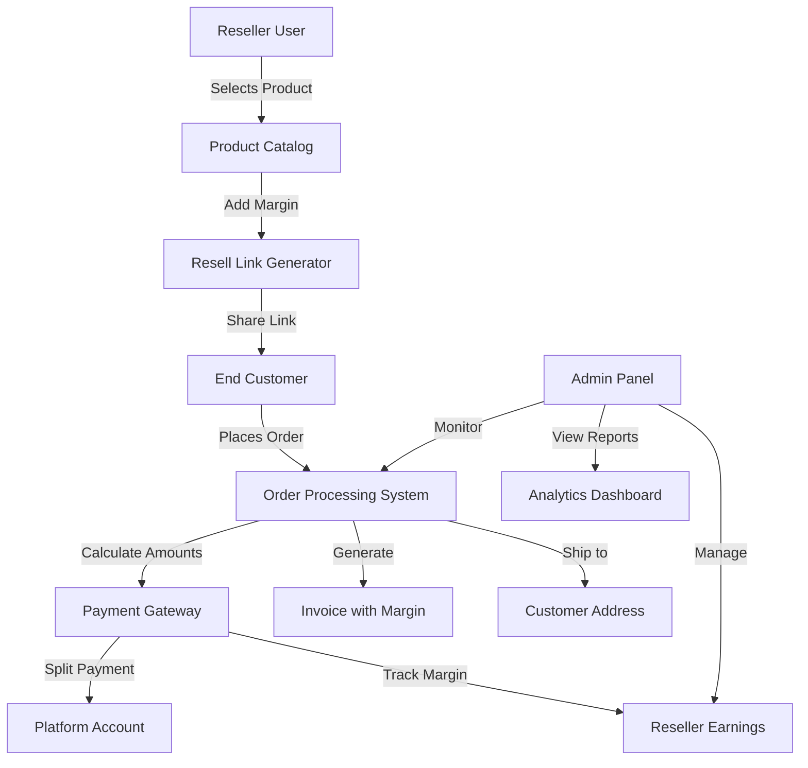
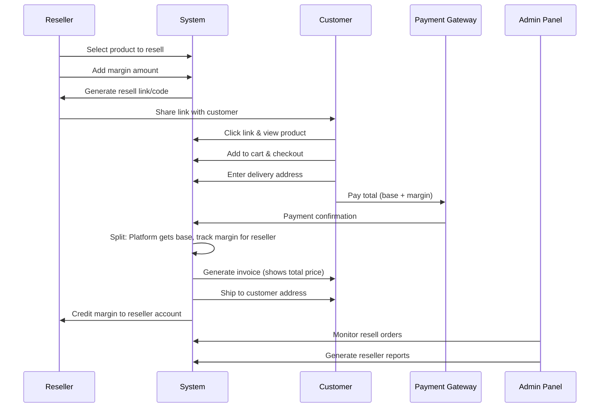

# Design Document: Product Resell Feature

## Overview

The Product Resell Feature enables users to act as resellers by sharing products with their customers at a marked-up price. Resellers add their own margin to the base product price, and when an order is placed, the delivery goes directly to the end customer's address. The reseller earns the margin amount while the platform receives the original product price. This feature is similar to Meesho's resell functionality and creates a marketplace where users can become micro-entrepreneurs.

The system tracks reseller information, manages margin calculations, handles payment distribution, generates invoices with margin breakdown, and provides comprehensive admin panel tools for monitoring and managing resell activities.

## Architecture



## Main Workflow




## Components and Interfaces

### Component 1: Resell Link Generator

**Purpose**: Creates unique resell links/codes that track the reseller and their margin

**Interface**:
```python
class ResellLinkGenerator:
    def create_resell_link(user_id: int, product_id: int, margin_amount: Decimal) -> ResellLink
    def validate_resell_link(resell_code: str) -> ResellLink
    def get_reseller_links(user_id: int) -> List[ResellLink]
```

**Responsibilities**:
- Generate unique resell codes for product-reseller combinations
- Store margin information with the link
- Validate resell codes during checkout
- Track link usage and conversions

### Component 2: Margin Calculator

**Purpose**: Calculates pricing breakdown for resell orders

**Interface**:
```python
class MarginCalculator:
    def calculate_total_price(base_price: Decimal, margin: Decimal, quantity: int) -> Decimal
    def calculate_reseller_earnings(order: Order) -> Decimal
    def validate_margin(margin: Decimal, base_price: Decimal) -> bool
```

**Responsibilities**:
- Calculate total customer price (base + margin)
- Compute reseller earnings from orders
- Validate margin amounts (min/max limits)
- Handle margin calculations for multiple items

### Component 3: Reseller Payment Manager

**Purpose**: Manages reseller earnings and payouts

**Interface**:
```python
class ResellerPaymentManager:
    def credit_reseller_earnings(order: Order) -> ResellerEarning
    def get_reseller_balance(user_id: int) -> Decimal
    def process_payout(user_id: int, amount: Decimal) -> PayoutTransaction
    def get_earnings_history(user_id: int) -> List[ResellerEarning]
```

**Responsibilities**:
- Track reseller earnings per order
- Maintain reseller account balance
- Process payout requests
- Generate earnings statements

### Component 4: Resell Order Processor

**Purpose**: Handles order creation and processing for resell orders

**Interface**:
```python
class ResellOrderProcessor:
    def create_resell_order(cart: Cart, resell_link: ResellLink, customer_address: Address) -> Order
    def process_payment(order: Order, payment_details: dict) -> PaymentResult
    def generate_invoice(order: Order) -> Invoice
    def update_order_status(order_id: int, status: str) -> Order
```

**Responsibilities**:
- Create orders with reseller tracking
- Process payments and split amounts
- Generate invoices with margin details
- Update order status through lifecycle

### Component 5: Admin Resell Dashboard

**Purpose**: Provides admin interface for managing resell operations

**Interface**:
```python
class AdminResellDashboard:
    def get_resell_orders(filters: dict) -> QuerySet[Order]
    def get_reseller_analytics(user_id: int) -> dict
    def generate_resell_report(date_range: tuple) -> Report
    def manage_reseller_status(user_id: int, status: str) -> User
```

**Responsibilities**:
- Display resell orders with filters
- Show reseller performance metrics
- Generate reports and analytics
- Manage reseller accounts and permissions


## Data Models

### Model 1: ResellLink

```python
class ResellLink(models.Model):
    """Tracks resell links created by users"""
    reseller = models.ForeignKey(User, on_delete=models.CASCADE, related_name='resell_links')
    product = models.ForeignKey(Product, on_delete=models.CASCADE, related_name='resell_links')
    resell_code = models.CharField(max_length=20, unique=True)
    margin_amount = models.DecimalField(max_digits=10, decimal_places=2)
    margin_percentage = models.DecimalField(max_digits=5, decimal_places=2, null=True, blank=True)
    is_active = models.BooleanField(default=True)
    views_count = models.PositiveIntegerField(default=0)
    orders_count = models.PositiveIntegerField(default=0)
    total_earnings = models.DecimalField(max_digits=10, decimal_places=2, default=0)
    created_at = models.DateTimeField(auto_now_add=True)
    expires_at = models.DateTimeField(null=True, blank=True)
```

**Validation Rules**:
- resell_code must be unique across all links
- margin_amount must be positive and within platform limits (e.g., 0-50% of base price)
- product must be active and available for reselling
- reseller must have reseller permissions enabled

### Model 2: ResellerEarning

```python
class ResellerEarning(models.Model):
    """Tracks earnings for each reseller from orders"""
    EARNING_STATUS_CHOICES = [
        ('PENDING', 'Pending'),
        ('CONFIRMED', 'Confirmed'),
        ('PAID', 'Paid'),
        ('CANCELLED', 'Cancelled'),
    ]
    
    reseller = models.ForeignKey(User, on_delete=models.CASCADE, related_name='reseller_earnings')
    order = models.OneToOneField(Order, on_delete=models.CASCADE, related_name='reseller_earning')
    resell_link = models.ForeignKey(ResellLink, on_delete=models.SET_NULL, null=True)
    margin_amount = models.DecimalField(max_digits=10, decimal_places=2)
    status = models.CharField(max_length=20, choices=EARNING_STATUS_CHOICES, default='PENDING')
    confirmed_at = models.DateTimeField(null=True, blank=True)
    paid_at = models.DateTimeField(null=True, blank=True)
    payout_transaction = models.ForeignKey('PayoutTransaction', on_delete=models.SET_NULL, null=True, blank=True)
    created_at = models.DateTimeField(auto_now_add=True)
```

**Validation Rules**:
- margin_amount must match the order's total margin
- status transitions: PENDING → CONFIRMED → PAID (or CANCELLED at any stage)
- confirmed_at set when order is delivered
- paid_at set when payout is processed

### Model 3: PayoutTransaction

```python
class PayoutTransaction(models.Model):
    """Tracks payout transactions to resellers"""
    PAYOUT_STATUS_CHOICES = [
        ('INITIATED', 'Initiated'),
        ('PROCESSING', 'Processing'),
        ('COMPLETED', 'Completed'),
        ('FAILED', 'Failed'),
    ]
    
    PAYOUT_METHOD_CHOICES = [
        ('BANK_TRANSFER', 'Bank Transfer'),
        ('UPI', 'UPI'),
        ('WALLET', 'Wallet'),
    ]
    
    reseller = models.ForeignKey(User, on_delete=models.CASCADE, related_name='payout_transactions')
    amount = models.DecimalField(max_digits=10, decimal_places=2)
    payout_method = models.CharField(max_length=20, choices=PAYOUT_METHOD_CHOICES)
    status = models.CharField(max_length=20, choices=PAYOUT_STATUS_CHOICES, default='INITIATED')
    transaction_id = models.CharField(max_length=100, blank=True)
    bank_account = models.CharField(max_length=100, blank=True)
    upi_id = models.CharField(max_length=100, blank=True)
    admin_notes = models.TextField(blank=True)
    initiated_at = models.DateTimeField(auto_now_add=True)
    completed_at = models.DateTimeField(null=True, blank=True)
```

**Validation Rules**:
- amount must be positive and not exceed reseller's available balance
- payout_method-specific fields must be provided (bank_account for BANK_TRANSFER, upi_id for UPI)
- transaction_id required when status is COMPLETED
- completed_at set when status changes to COMPLETED

### Model 4: ResellerProfile

```python
class ResellerProfile(models.Model):
    """Extended profile for users who are resellers"""
    user = models.OneToOneField(User, on_delete=models.CASCADE, related_name='reseller_profile')
    is_reseller_enabled = models.BooleanField(default=False)
    business_name = models.CharField(max_length=200, blank=True)
    total_earnings = models.DecimalField(max_digits=10, decimal_places=2, default=0)
    available_balance = models.DecimalField(max_digits=10, decimal_places=2, default=0)
    total_orders = models.PositiveIntegerField(default=0)
    bank_account_name = models.CharField(max_length=200, blank=True)
    bank_account_number = models.CharField(max_length=50, blank=True)
    bank_ifsc_code = models.CharField(max_length=20, blank=True)
    upi_id = models.CharField(max_length=100, blank=True)
    pan_number = models.CharField(max_length=10, blank=True)
    created_at = models.DateTimeField(auto_now_add=True)
    updated_at = models.DateTimeField(auto_now=True)
```

**Validation Rules**:
- user can only have one reseller profile
- bank_account_number and bank_ifsc_code required for bank payouts
- upi_id required for UPI payouts
- pan_number required for payouts above tax threshold
- available_balance cannot be negative


### Model 5: Order (Enhanced)

```python
# Enhancements to existing Order model
class Order(models.Model):
    # ... existing fields ...
    
    # Enhanced resell fields
    is_resell = models.BooleanField(default=False)
    reseller = models.ForeignKey(User, on_delete=models.SET_NULL, null=True, blank=True, related_name='resold_orders')
    resell_link = models.ForeignKey(ResellLink, on_delete=models.SET_NULL, null=True, blank=True)
    total_margin = models.DecimalField(max_digits=10, decimal_places=2, default=0)
    base_amount = models.DecimalField(max_digits=10, decimal_places=2, default=0)
    
    # Remove old fields (deprecated)
    # resell_from_name - replaced by reseller ForeignKey
    # resell_from_phone - available through reseller.phone
```

**Validation Rules**:
- If is_resell=True, reseller and resell_link must be set
- total_margin = sum of all OrderItem margin_amount
- base_amount = subtotal - total_margin
- total_amount = base_amount + total_margin + tax + shipping_cost - coupon_discount

### Model 6: OrderItem (Enhanced)

```python
# Enhancements to existing OrderItem model
class OrderItem(models.Model):
    # ... existing fields ...
    
    # Enhanced margin tracking
    base_price = models.DecimalField(max_digits=10, decimal_places=2)
    margin_amount = models.DecimalField(max_digits=10, decimal_places=2, default=0)
    # product_price = base_price + margin_amount (for display to customer)
```

**Validation Rules**:
- base_price is the original product price
- margin_amount is the reseller's markup per unit
- product_price = base_price + margin_amount
- subtotal = product_price × quantity

## Algorithmic Pseudocode

### Algorithm 1: Create Resell Link

```pascal
ALGORITHM createResellLink(reseller, product, marginAmount)
INPUT: reseller of type User, product of type Product, marginAmount of type Decimal
OUTPUT: resellLink of type ResellLink

PRECONDITIONS:
  - reseller is authenticated and has reseller permissions
  - product is active and available for reselling
  - marginAmount > 0 AND marginAmount <= (product.price * 0.5)

BEGIN
  // Step 1: Validate margin amount
  IF marginAmount <= 0 OR marginAmount > (product.price * 0.5) THEN
    RAISE ValidationError("Margin must be between 0 and 50% of product price")
  END IF
  
  // Step 2: Generate unique resell code
  resellCode ← generateUniqueCode(8)
  WHILE ResellLink.exists(resell_code=resellCode) DO
    resellCode ← generateUniqueCode(8)
  END WHILE
  
  // Step 3: Calculate margin percentage
  marginPercentage ← (marginAmount / product.price) * 100
  
  // Step 4: Create resell link
  resellLink ← ResellLink.create(
    reseller=reseller,
    product=product,
    resell_code=resellCode,
    margin_amount=marginAmount,
    margin_percentage=marginPercentage,
    is_active=true
  )
  
  // Step 5: Generate shareable URL
  shareableURL ← buildURL("/product/" + product.slug + "?resell=" + resellCode)
  
  RETURN resellLink
END

POSTCONDITIONS:
  - resellLink is created and saved to database
  - resellLink.resell_code is unique
  - resellLink.is_active = true
  - Shareable URL contains resell code
```

### Algorithm 2: Process Resell Order

```pascal
ALGORITHM processResellOrder(cart, resellLink, customerAddress, paymentDetails)
INPUT: cart of type Cart, resellLink of type ResellLink, customerAddress of type Address, paymentDetails of type dict
OUTPUT: order of type Order

PRECONDITIONS:
  - cart is not empty
  - resellLink is active and valid
  - customerAddress is complete and valid
  - paymentDetails contains valid payment information

BEGIN
  // Step 1: Validate resell link
  IF NOT resellLink.is_active THEN
    RAISE ValidationError("Resell link is no longer active")
  END IF
  
  // Step 2: Calculate order amounts
  baseAmount ← 0
  totalMargin ← 0
  
  FOR each item IN cart.items DO
    basePrice ← item.product.price
    marginAmount ← resellLink.margin_amount
    itemTotal ← (basePrice + marginAmount) * item.quantity
    
    baseAmount ← baseAmount + (basePrice * item.quantity)
    totalMargin ← totalMargin + (marginAmount * item.quantity)
  END FOR
  
  subtotal ← baseAmount + totalMargin
  tax ← calculateTax(subtotal)
  shippingCost ← calculateShipping(customerAddress)
  totalAmount ← subtotal + tax + shippingCost
  
  // Step 3: Process payment
  paymentResult ← processPayment(paymentDetails, totalAmount)
  
  IF paymentResult.status != "SUCCESS" THEN
    RAISE PaymentError("Payment processing failed")
  END IF
  
  // Step 4: Create order
  order ← Order.create(
    user=cart.user,
    is_resell=true,
    reseller=resellLink.reseller,
    resell_link=resellLink,
    base_amount=baseAmount,
    total_margin=totalMargin,
    subtotal=subtotal,
    tax=tax,
    shipping_cost=shippingCost,
    total_amount=totalAmount,
    shipping_address=customerAddress.toString(),
    payment_status="PAID",
    order_status="PENDING"
  )
  
  // Step 5: Create order items
  FOR each item IN cart.items DO
    OrderItem.create(
      order=order,
      product=item.product,
      base_price=item.product.price,
      margin_amount=resellLink.margin_amount,
      product_price=item.product.price + resellLink.margin_amount,
      quantity=item.quantity,
      subtotal=(item.product.price + resellLink.margin_amount) * item.quantity
    )
  END FOR
  
  // Step 6: Create reseller earning record
  ResellerEarning.create(
    reseller=resellLink.reseller,
    order=order,
    resell_link=resellLink,
    margin_amount=totalMargin,
    status="PENDING"
  )
  
  // Step 7: Update resell link statistics
  resellLink.orders_count ← resellLink.orders_count + 1
  resellLink.total_earnings ← resellLink.total_earnings + totalMargin
  resellLink.save()
  
  // Step 8: Clear cart
  cart.clear()
  
  RETURN order
END

POSTCONDITIONS:
  - order is created with is_resell=true
  - order.reseller points to the reseller user
  - order.total_margin equals sum of all item margins
  - ResellerEarning record created with status="PENDING"
  - resellLink statistics updated
  - cart is empty
```


### Algorithm 3: Confirm Reseller Earnings

```pascal
ALGORITHM confirmResellerEarnings(order)
INPUT: order of type Order
OUTPUT: earning of type ResellerEarning

PRECONDITIONS:
  - order.is_resell = true
  - order.order_status = "DELIVERED"
  - order has associated ResellerEarning with status="PENDING"

BEGIN
  // Step 1: Get reseller earning record
  earning ← ResellerEarning.get(order=order)
  
  IF earning.status != "PENDING" THEN
    RAISE ValidationError("Earning already confirmed or cancelled")
  END IF
  
  // Step 2: Update earning status
  earning.status ← "CONFIRMED"
  earning.confirmed_at ← getCurrentTimestamp()
  earning.save()
  
  // Step 3: Update reseller profile balance
  resellerProfile ← earning.reseller.reseller_profile
  resellerProfile.available_balance ← resellerProfile.available_balance + earning.margin_amount
  resellerProfile.total_earnings ← resellerProfile.total_earnings + earning.margin_amount
  resellerProfile.total_orders ← resellerProfile.total_orders + 1
  resellerProfile.save()
  
  // Step 4: Send notification to reseller
  sendNotification(
    user=earning.reseller,
    title="Earnings Confirmed",
    message="Your earnings of ₹" + earning.margin_amount + " from order " + order.order_number + " have been confirmed"
  )
  
  RETURN earning
END

POSTCONDITIONS:
  - earning.status = "CONFIRMED"
  - earning.confirmed_at is set
  - reseller's available_balance increased by margin_amount
  - reseller's total_earnings increased by margin_amount
  - reseller's total_orders incremented by 1
  - notification sent to reseller
```

### Algorithm 4: Process Reseller Payout

```pascal
ALGORITHM processResellerPayout(reseller, amount, payoutMethod, paymentDetails)
INPUT: reseller of type User, amount of type Decimal, payoutMethod of type String, paymentDetails of type dict
OUTPUT: payoutTransaction of type PayoutTransaction

PRECONDITIONS:
  - reseller has reseller_profile
  - amount > 0 AND amount <= reseller.reseller_profile.available_balance
  - payoutMethod IN ["BANK_TRANSFER", "UPI", "WALLET"]
  - paymentDetails contains required fields for payoutMethod

BEGIN
  // Step 1: Validate payout amount
  resellerProfile ← reseller.reseller_profile
  
  IF amount <= 0 OR amount > resellerProfile.available_balance THEN
    RAISE ValidationError("Invalid payout amount")
  END IF
  
  // Step 2: Validate payment details
  IF payoutMethod = "BANK_TRANSFER" THEN
    IF NOT paymentDetails.contains("bank_account_number") OR NOT paymentDetails.contains("bank_ifsc_code") THEN
      RAISE ValidationError("Bank account details required")
    END IF
  ELSE IF payoutMethod = "UPI" THEN
    IF NOT paymentDetails.contains("upi_id") THEN
      RAISE ValidationError("UPI ID required")
    END IF
  END IF
  
  // Step 3: Create payout transaction
  payoutTransaction ← PayoutTransaction.create(
    reseller=reseller,
    amount=amount,
    payout_method=payoutMethod,
    status="INITIATED",
    bank_account=paymentDetails.get("bank_account_number", ""),
    upi_id=paymentDetails.get("upi_id", "")
  )
  
  // Step 4: Deduct from available balance
  resellerProfile.available_balance ← resellerProfile.available_balance - amount
  resellerProfile.save()
  
  // Step 5: Process payment through gateway
  TRY
    paymentResult ← paymentGateway.transfer(
      amount=amount,
      method=payoutMethod,
      details=paymentDetails
    )
    
    IF paymentResult.status = "SUCCESS" THEN
      payoutTransaction.status ← "COMPLETED"
      payoutTransaction.transaction_id ← paymentResult.transaction_id
      payoutTransaction.completed_at ← getCurrentTimestamp()
      
      // Update earnings to PAID status
      earnings ← ResellerEarning.filter(
        reseller=reseller,
        status="CONFIRMED",
        payout_transaction=null
      )
      
      FOR each earning IN earnings DO
        earning.status ← "PAID"
        earning.paid_at ← getCurrentTimestamp()
        earning.payout_transaction ← payoutTransaction
        earning.save()
      END FOR
      
    ELSE
      payoutTransaction.status ← "FAILED"
      // Refund to available balance
      resellerProfile.available_balance ← resellerProfile.available_balance + amount
      resellerProfile.save()
    END IF
    
  CATCH PaymentException AS e
    payoutTransaction.status ← "FAILED"
    payoutTransaction.admin_notes ← e.message
    // Refund to available balance
    resellerProfile.available_balance ← resellerProfile.available_balance + amount
    resellerProfile.save()
  END TRY
  
  payoutTransaction.save()
  
  // Step 6: Send notification
  IF payoutTransaction.status = "COMPLETED" THEN
    sendNotification(
      user=reseller,
      title="Payout Successful",
      message="₹" + amount + " has been transferred to your account"
    )
  ELSE
    sendNotification(
      user=reseller,
      title="Payout Failed",
      message="Payout of ₹" + amount + " failed. Amount refunded to your balance"
    )
  END IF
  
  RETURN payoutTransaction
END

POSTCONDITIONS:
  - payoutTransaction is created
  - If successful: available_balance decreased, earnings marked as PAID
  - If failed: available_balance restored
  - notification sent to reseller
```


### Algorithm 5: Generate Invoice with Margin

```pascal
ALGORITHM generateInvoiceWithMargin(order)
INPUT: order of type Order
OUTPUT: invoice of type Invoice

PRECONDITIONS:
  - order exists and is valid
  - order.payment_status = "PAID"
  - order has associated order items

BEGIN
  // Step 1: Initialize invoice data
  invoiceData ← {
    order_number: order.order_number,
    invoice_number: order.invoice_number OR generateInvoiceNumber(),
    order_date: order.order_date,
    customer_name: order.user.get_full_name(),
    shipping_address: order.shipping_address,
    items: [],
    subtotal: 0,
    tax: order.tax,
    shipping_cost: order.shipping_cost,
    total: order.total_amount
  }
  
  // Step 2: Add order items to invoice
  FOR each item IN order.items.all() DO
    itemData ← {
      product_name: item.product_name,
      quantity: item.quantity,
      unit_price: item.product_price,  // This includes margin
      subtotal: item.subtotal
    }
    
    invoiceData.items.append(itemData)
    invoiceData.subtotal ← invoiceData.subtotal + item.subtotal
  END FOR
  
  // Step 3: Add discount if applicable
  IF order.coupon_discount > 0 THEN
    invoiceData.discount ← order.coupon_discount
    invoiceData.coupon_code ← order.coupon.code
  END IF
  
  // Step 4: Generate PDF invoice
  invoice ← generatePDFInvoice(invoiceData)
  
  // Step 5: Store invoice reference
  IF NOT order.invoice_number THEN
    order.invoice_number ← invoiceData.invoice_number
    order.save()
  END IF
  
  RETURN invoice
END

POSTCONDITIONS:
  - invoice contains all order items with prices including margin
  - invoice shows total amount paid by customer
  - margin is NOT separately shown to customer (included in unit price)
  - invoice_number is assigned to order if not already present
```

## Key Functions with Formal Specifications

### Function 1: validate_margin_amount()

```python
def validate_margin_amount(margin: Decimal, base_price: Decimal, max_percentage: Decimal = Decimal('50.0')) -> bool
```

**Preconditions:**
- margin is a Decimal value
- base_price is a positive Decimal value
- max_percentage is a positive Decimal value (default 50.0)

**Postconditions:**
- Returns True if margin is valid (0 < margin <= base_price * max_percentage / 100)
- Returns False otherwise
- No side effects on input parameters

**Loop Invariants:** N/A (no loops)

### Function 2: calculate_reseller_commission()

```python
def calculate_reseller_commission(order: Order) -> Decimal
```

**Preconditions:**
- order is a valid Order instance
- order.is_resell is True
- order has at least one OrderItem

**Postconditions:**
- Returns total margin amount from all order items
- Result equals sum of (item.margin_amount * item.quantity) for all items
- Returns Decimal('0.00') if order is not a resell order
- No mutations to order or its items

**Loop Invariants:**
- For each iteration: accumulated commission is sum of margins from processed items
- All processed items have valid margin_amount values

### Function 3: get_reseller_dashboard_data()

```python
def get_reseller_dashboard_data(reseller: User) -> dict
```

**Preconditions:**
- reseller is a valid User instance
- reseller has a reseller_profile

**Postconditions:**
- Returns dictionary with keys: total_earnings, available_balance, total_orders, pending_earnings, recent_orders
- All monetary values are Decimal type
- recent_orders is a QuerySet of most recent 10 orders
- No side effects on database

**Loop Invariants:** N/A (uses database aggregation)


## Example Usage

### Example 1: Reseller Creates a Resell Link

```python
# Reseller selects a product and adds margin
reseller = request.user
product = Product.objects.get(id=123)
margin_amount = Decimal('50.00')  # ₹50 margin

# Create resell link
resell_link = ResellLink.objects.create(
    reseller=reseller,
    product=product,
    resell_code=generate_unique_code(8),
    margin_amount=margin_amount,
    margin_percentage=(margin_amount / product.price) * 100,
    is_active=True
)

# Generate shareable URL
share_url = f"https://example.com/product/{product.slug}?resell={resell_link.resell_code}"

# Reseller shares this URL with customers
```

### Example 2: Customer Places Order via Resell Link

```python
# Customer clicks resell link and adds product to cart
resell_code = request.GET.get('resell')
resell_link = ResellLink.objects.get(resell_code=resell_code, is_active=True)

# Store resell link in session
request.session['resell_link_id'] = resell_link.id

# At checkout, create resell order
cart = Cart.objects.filter(user=request.user)
resell_link = ResellLink.objects.get(id=request.session['resell_link_id'])

# Calculate amounts
base_amount = sum(item.product.price * item.quantity for item in cart)
total_margin = sum(resell_link.margin_amount * item.quantity for item in cart)
total_amount = base_amount + total_margin + tax + shipping

# Create order
order = Order.objects.create(
    user=request.user,
    is_resell=True,
    reseller=resell_link.reseller,
    resell_link=resell_link,
    base_amount=base_amount,
    total_margin=total_margin,
    total_amount=total_amount,
    shipping_address=customer_address,
    payment_status='PAID'
)

# Create order items with margin
for cart_item in cart:
    OrderItem.objects.create(
        order=order,
        product=cart_item.product,
        base_price=cart_item.product.price,
        margin_amount=resell_link.margin_amount,
        product_price=cart_item.product.price + resell_link.margin_amount,
        quantity=cart_item.quantity
    )

# Create reseller earning
ResellerEarning.objects.create(
    reseller=resell_link.reseller,
    order=order,
    resell_link=resell_link,
    margin_amount=total_margin,
    status='PENDING'
)
```

### Example 3: Admin Confirms Earnings After Delivery

```python
# When order is delivered, confirm reseller earnings
order = Order.objects.get(order_number='ORD123456')
order.order_status = 'DELIVERED'
order.save()

# Get and confirm earning
earning = ResellerEarning.objects.get(order=order)
earning.status = 'CONFIRMED'
earning.confirmed_at = timezone.now()
earning.save()

# Update reseller balance
reseller_profile = earning.reseller.reseller_profile
reseller_profile.available_balance += earning.margin_amount
reseller_profile.total_earnings += earning.margin_amount
reseller_profile.total_orders += 1
reseller_profile.save()

# Send notification
Notification.objects.create(
    user=earning.reseller,
    title='Earnings Confirmed',
    message=f'Your earnings of ₹{earning.margin_amount} have been confirmed'
)
```

### Example 4: Reseller Requests Payout

```python
# Reseller requests payout
reseller = request.user
reseller_profile = reseller.reseller_profile
payout_amount = Decimal('500.00')

# Validate balance
if payout_amount > reseller_profile.available_balance:
    raise ValidationError('Insufficient balance')

# Create payout transaction
payout = PayoutTransaction.objects.create(
    reseller=reseller,
    amount=payout_amount,
    payout_method='UPI',
    upi_id=reseller_profile.upi_id,
    status='INITIATED'
)

# Deduct from balance
reseller_profile.available_balance -= payout_amount
reseller_profile.save()

# Process payment (via payment gateway)
try:
    result = payment_gateway.transfer(
        amount=payout_amount,
        upi_id=reseller_profile.upi_id
    )
    
    if result['status'] == 'SUCCESS':
        payout.status = 'COMPLETED'
        payout.transaction_id = result['transaction_id']
        payout.completed_at = timezone.now()
        
        # Mark earnings as paid
        earnings = ResellerEarning.objects.filter(
            reseller=reseller,
            status='CONFIRMED',
            payout_transaction__isnull=True
        )
        earnings.update(
            status='PAID',
            paid_at=timezone.now(),
            payout_transaction=payout
        )
    else:
        payout.status = 'FAILED'
        # Refund balance
        reseller_profile.available_balance += payout_amount
        reseller_profile.save()
        
except Exception as e:
    payout.status = 'FAILED'
    payout.admin_notes = str(e)
    # Refund balance
    reseller_profile.available_balance += payout_amount
    reseller_profile.save()

payout.save()
```


## Correctness Properties

*A property is a characteristic or behavior that should hold true across all valid executions of a system—essentially, a formal statement about what the system should do. Properties serve as the bridge between human-readable specifications and machine-verifiable correctness guarantees.*

### Property 1: Margin Calculation Consistency

*For any* resell order, the total margin must equal the sum of individual item margins multiplied by their quantities.

**Validates: Requirements 3.5, 13.3**

### Property 2: Payment Distribution Integrity

*For any* paid resell order, the total amount must equal base amount plus total margin plus tax plus shipping cost minus coupon discount.

**Validates: Requirements 4.1, 13.2**

### Property 3: Reseller Balance Consistency

*For any* reseller, the available balance must equal the sum of confirmed earnings minus the sum of completed payouts.

**Validates: Requirements 5.5, 6.6, 13.1**

### Property 4: Earning Status Progression

*For any* reseller earning, if the status is CONFIRMED then the order must be DELIVERED, and if the status is PAID then a completed payout transaction must exist.

**Validates: Requirements 5.1, 5.2, 5.3, 6.9**

### Property 5: Resell Link Uniqueness

*For any* two distinct resell links, their resell codes must be different.

**Validates: Requirements 1.1, 1.2**

### Property 6: Order Item Price Composition

*For any* order item in a resell order, the product price must equal base price plus margin amount.

**Validates: Requirements 3.1, 13.4**

### Property 7: Invoice Amount Accuracy

*For any* order with an invoice, the invoice total must match the order total, and the invoice subtotal must equal the sum of item prices multiplied by quantities.

**Validates: Requirements 7.2, 7.4, 7.6**

### Property 8: Payout Amount Validation

*For any* initiated payout, the payout amount must not exceed the reseller's available balance at the time of creation.

**Validates: Requirements 6.1, 6.2**

### Property 9: Margin Percentage Calculation

*For any* resell link, the margin percentage must equal (margin amount divided by base price) multiplied by 100.

**Validates: Requirement 1.4**

### Property 10: Resell Link Default Status

*For any* newly created resell link, the is_active flag must be true.

**Validates: Requirement 1.6**

### Property 11: Resell Order Association

*For any* order where is_resell is true, both reseller and resell_link must be set.

**Validates: Requirements 3.3, 3.4, 13.6**

### Property 12: Order Item Subtotal Calculation

*For any* order item, the subtotal must equal product price multiplied by quantity.

**Validates: Requirement 13.5**

### Property 13: Payout Failure Balance Restoration

*For any* payout that fails, the reseller's available balance after failure must equal the balance before initiation.

**Validates: Requirement 6.10**

### Property 14: Margin Validation Bounds

*For any* margin amount and base price, the margin is valid if and only if it is greater than zero and does not exceed 50% of the base price.

**Validates: Requirement 1.3**

### Property 15: Reseller Profile Uniqueness

*For any* user, there exists at most one reseller profile associated with that user.

**Validates: Requirement 10.7**

### Property 16: Link Statistics Update on Order

*For any* resell link, when an order is created through that link, the orders count must increment by one and total earnings must increase by the margin amount.

**Validates: Requirements 3.8, 3.9**

### Property 17: Earnings Confirmation Balance Update

*For any* reseller earning that transitions from PENDING to CONFIRMED, the reseller's available balance must increase by the margin amount, total earnings must increase by the margin amount, and total orders must increment by one.

**Validates: Requirements 5.5, 5.6, 5.7**

### Property 18: Invoice Margin Privacy

*For any* invoice generated for a customer, the margin amount must not be separately displayed.

**Validates: Requirement 7.7**

### Property 19: Resell Link Deactivation Effect

*For any* resell link that is deactivated, new order attempts through that link must be rejected.

**Validates: Requirements 11.2, 11.3**

### Property 20: Order Cancellation Earning Adjustment

*For any* resell order that is cancelled, if the earning status is CONFIRMED, the reseller's available balance must decrease by the margin amount.

**Validates: Requirements 12.1, 12.3**

## Error Handling

### Error Scenario 1: Invalid Margin Amount

**Condition:** Reseller attempts to set margin higher than allowed limit (e.g., >50% of base price)

**Response:** 
- Reject resell link creation
- Return validation error with message: "Margin cannot exceed 50% of product price"
- Suggest maximum allowed margin amount

**Recovery:** User can retry with valid margin amount

### Error Scenario 2: Inactive Resell Link

**Condition:** Customer attempts to use expired or deactivated resell link

**Response:**
- Display error message: "This resell link is no longer active"
- Redirect to regular product page without margin
- Log the attempt for analytics

**Recovery:** Customer can purchase at regular price or contact reseller for new link

### Error Scenario 3: Insufficient Balance for Payout

**Condition:** Reseller requests payout amount greater than available balance

**Response:**
- Reject payout request
- Display current available balance
- Show message: "Insufficient balance. Available: ₹{balance}"

**Recovery:** Reseller can request lower amount or wait for more earnings to be confirmed

### Error Scenario 4: Payment Gateway Failure During Payout

**Condition:** Payment gateway fails while processing reseller payout

**Response:**
- Mark payout transaction as FAILED
- Automatically refund amount to reseller's available balance
- Log error details in admin_notes
- Send notification to reseller about failure

**Recovery:** 
- Reseller can retry payout after some time
- Admin can manually process if issue persists

### Error Scenario 5: Order Cancellation After Earning Confirmation

**Condition:** Order is cancelled or returned after reseller earning was confirmed

**Response:**
- Update ResellerEarning status to CANCELLED
- Deduct margin amount from reseller's available_balance
- If balance becomes negative, flag for admin review
- Send notification to reseller about cancellation

**Recovery:**
- Admin reviews and resolves negative balance cases
- Reseller can dispute if cancellation was invalid

### Error Scenario 6: Duplicate Resell Code Generation

**Condition:** Generated resell code already exists (collision)

**Response:**
- Regenerate new unique code
- Retry up to 5 times
- If still fails, use UUID-based code generation

**Recovery:** System automatically handles without user intervention


## Testing Strategy

### Unit Testing Approach

**Key Test Cases:**

1. **Resell Link Creation**
   - Test valid margin amounts (within limits)
   - Test invalid margin amounts (negative, zero, exceeds limit)
   - Test unique code generation
   - Test margin percentage calculation

2. **Margin Calculation**
   - Test single item margin calculation
   - Test multiple items with same margin
   - Test multiple items with different margins
   - Test margin with quantity > 1

3. **Order Processing**
   - Test resell order creation with valid data
   - Test order amount calculations (base + margin + tax + shipping)
   - Test order item creation with margin tracking
   - Test reseller earning record creation

4. **Earning Confirmation**
   - Test earning status transitions (PENDING → CONFIRMED → PAID)
   - Test balance updates on confirmation
   - Test notification sending

5. **Payout Processing**
   - Test valid payout requests
   - Test insufficient balance scenarios
   - Test balance deduction and restoration on failure
   - Test earning status updates on successful payout

**Coverage Goals:**
- Minimum 85% code coverage for resell-related modules
- 100% coverage for critical payment and balance calculation functions
- Edge cases for all validation functions

### Property-Based Testing Approach

**Property Test Library:** Hypothesis (Python)

**Property Tests:**

1. **Margin Calculation Property**
   ```python
   @given(
       base_price=decimals(min_value=1, max_value=10000, places=2),
       margin_amount=decimals(min_value=0.01, max_value=5000, places=2),
       quantity=integers(min_value=1, max_value=100)
   )
   def test_margin_calculation_property(base_price, margin_amount, quantity):
       # Property: total = (base + margin) * quantity
       total = (base_price + margin_amount) * quantity
       assert total == calculate_order_item_total(base_price, margin_amount, quantity)
   ```

2. **Balance Consistency Property**
   ```python
   @given(
       confirmed_earnings=lists(decimals(min_value=0, max_value=1000, places=2)),
       completed_payouts=lists(decimals(min_value=0, max_value=1000, places=2))
   )
   def test_balance_consistency_property(confirmed_earnings, completed_payouts):
       # Property: balance = sum(earnings) - sum(payouts)
       expected_balance = sum(confirmed_earnings) - sum(completed_payouts)
       assert expected_balance >= 0  # Balance should never be negative
   ```

3. **Price Composition Property**
   ```python
   @given(
       base_price=decimals(min_value=1, max_value=10000, places=2),
       margin_percentage=decimals(min_value=0, max_value=50, places=2)
   )
   def test_price_composition_property(base_price, margin_percentage):
       # Property: customer_price = base_price + (base_price * margin_percentage / 100)
       margin_amount = base_price * margin_percentage / 100
       customer_price = base_price + margin_amount
       assert customer_price > base_price
       assert margin_amount <= base_price * Decimal('0.5')  # Max 50%
   ```

### Integration Testing Approach

**Integration Test Scenarios:**

1. **End-to-End Resell Flow**
   - Reseller creates link → Customer uses link → Order placed → Payment processed → Earning confirmed → Payout requested → Payout completed
   - Verify data consistency across all models
   - Verify notifications sent at each step

2. **Admin Panel Integration**
   - Test resell order filtering and display
   - Test reseller analytics calculations
   - Test bulk operations (approve earnings, process payouts)

3. **Payment Gateway Integration**
   - Test payment processing for resell orders
   - Test payout transfers to reseller accounts
   - Test webhook handling for payment status updates

4. **Invoice Generation Integration**
   - Test invoice generation with margin-inclusive prices
   - Test PDF rendering
   - Test invoice email delivery

**Test Environment:**
- Use test payment gateway (sandbox mode)
- Mock external services where necessary
- Use test database with realistic data volumes

## Performance Considerations

### Database Optimization

1. **Indexing Strategy**
   - Add index on `ResellLink.resell_code` for fast lookup during checkout
   - Add composite index on `Order(is_resell, reseller_id)` for reseller dashboard queries
   - Add index on `ResellerEarning(reseller_id, status)` for balance calculations
   - Add index on `PayoutTransaction(reseller_id, status)` for payout history

2. **Query Optimization**
   - Use `select_related()` for reseller and resell_link in order queries
   - Use `prefetch_related()` for order items when displaying resell orders
   - Implement pagination for reseller order lists (50 orders per page)
   - Cache reseller dashboard statistics (5-minute TTL)

3. **Aggregation Queries**
   - Use database aggregation for balance calculations instead of Python loops
   - Implement materialized views for reseller analytics (daily refresh)
   - Use `annotate()` for calculating total earnings per reseller

### Caching Strategy

1. **Resell Link Cache**
   - Cache active resell links by code (1-hour TTL)
   - Invalidate on link deactivation or expiration

2. **Reseller Dashboard Cache**
   - Cache dashboard statistics (5-minute TTL)
   - Invalidate on new order or payout

3. **Product Margin Cache**
   - Cache product base prices for margin calculation (15-minute TTL)
   - Invalidate on product price update

### Scalability Considerations

1. **Concurrent Order Processing**
   - Use database transactions for order creation to prevent race conditions
   - Implement optimistic locking for balance updates
   - Use message queue for asynchronous earning confirmations

2. **High-Volume Resellers**
   - Implement rate limiting on resell link creation (10 links per hour per user)
   - Batch process earning confirmations (every 15 minutes)
   - Implement pagination for large order lists

3. **Payout Processing**
   - Process payouts in batches (every 6 hours)
   - Implement queue system for payout requests
   - Set minimum payout amount (₹100) to reduce transaction volume


## Security Considerations

### Authentication & Authorization

1. **Reseller Permissions**
   - Implement `is_reseller_enabled` flag on user profile
   - Verify reseller status before allowing link creation
   - Implement admin approval process for new resellers
   - Rate limit resell link creation to prevent abuse

2. **Access Control**
   - Resellers can only view their own earnings and payouts
   - Resellers cannot modify confirmed earnings
   - Only admins can manually adjust balances
   - Implement role-based access control (RBAC) for admin panel

3. **API Security**
   - Require authentication for all resell-related endpoints
   - Implement CSRF protection on form submissions
   - Use JWT tokens for API authentication
   - Validate resell codes server-side (never trust client)

### Data Protection

1. **Sensitive Information**
   - Encrypt bank account numbers and UPI IDs at rest
   - Mask payment details in logs and admin panel
   - Implement PCI DSS compliance for payment data
   - Use HTTPS for all resell-related communications

2. **PII Protection**
   - Store minimal customer information in resell links
   - Anonymize customer data in reseller analytics
   - Implement data retention policies (delete old resell links after 1 year)
   - Comply with GDPR/data protection regulations

### Fraud Prevention

1. **Margin Abuse Prevention**
   - Enforce maximum margin limits (50% of base price)
   - Flag unusually high margins for admin review
   - Monitor resellers with high cancellation rates
   - Implement velocity checks (max 10 links per hour)

2. **Payment Fraud Detection**
   - Validate payment details before processing payouts
   - Implement two-factor authentication for payout requests
   - Flag suspicious payout patterns (multiple accounts, rapid withdrawals)
   - Hold earnings for 7 days before allowing payout (cooling period)

3. **Link Abuse Prevention**
   - Implement link expiration (90 days default)
   - Track link usage patterns (views vs conversions)
   - Disable links with suspicious activity
   - Implement CAPTCHA for high-volume link creation

### Transaction Security

1. **Payment Processing**
   - Use secure payment gateway APIs (Razorpay, Stripe)
   - Implement idempotency keys for payment requests
   - Verify payment signatures and webhooks
   - Log all payment transactions for audit trail

2. **Balance Integrity**
   - Use database transactions for balance updates
   - Implement double-entry bookkeeping for earnings
   - Regular reconciliation of balances vs transactions
   - Alert on negative balances or anomalies

3. **Audit Logging**
   - Log all resell link creations and modifications
   - Log all earning confirmations and status changes
   - Log all payout requests and completions
   - Implement tamper-proof audit logs (append-only)

### Input Validation

1. **Margin Validation**
   - Validate margin amount is positive and within limits
   - Sanitize margin input to prevent injection attacks
   - Validate margin against current product price
   - Reject margins that would result in negative platform revenue

2. **Payment Details Validation**
   - Validate bank account numbers (checksum validation)
   - Validate IFSC codes against RBI database
   - Validate UPI IDs format
   - Verify PAN number format for tax compliance

3. **Resell Code Validation**
   - Validate code format (alphanumeric, 8 characters)
   - Check code uniqueness before creation
   - Validate code exists and is active during checkout
   - Prevent SQL injection in code lookup queries

## Dependencies

### External Services

1. **Payment Gateway**
   - **Service:** Razorpay (primary)
   - **Purpose:** Process customer payments and reseller payouts
   - **API Version:** v1
   - **Required Features:** Payment capture, refunds, transfers, webhooks

2. **SMS Service**
   - **Service:** Twilio or MSG91
   - **Purpose:** Send OTP for payout verification
   - **Required Features:** SMS sending, delivery status tracking

3. **Email Service**
   - **Service:** SendGrid or AWS SES
   - **Purpose:** Send notifications and invoices
   - **Required Features:** Transactional emails, templates, tracking

### Python Libraries

1. **Django Extensions**
   - `django-money` - For currency handling and conversions
   - `django-fsm` - For state machine management (earning status transitions)
   - `django-celery-beat` - For scheduled tasks (earning confirmations, payout processing)

2. **Payment Processing**
   - `razorpay` - Razorpay Python SDK
   - `stripe` - Stripe Python SDK (backup gateway)

3. **PDF Generation**
   - `weasyprint` - For invoice PDF generation (already in use)
   - `reportlab` - Alternative PDF library

4. **Testing**
   - `hypothesis` - Property-based testing
   - `factory_boy` - Test data generation
   - `faker` - Fake data generation

5. **Utilities**
   - `shortuuid` - For generating unique resell codes
   - `python-decouple` - For configuration management
   - `redis` - For caching and session management

### Database Requirements

1. **PostgreSQL Extensions**
   - `pg_trgm` - For fuzzy search on reseller names
   - `btree_gin` - For composite index optimization

2. **Schema Changes**
   - New tables: `ResellLink`, `ResellerEarning`, `PayoutTransaction`, `ResellerProfile`
   - Modified tables: `Order` (add reseller, resell_link, total_margin, base_amount), `OrderItem` (add base_price, margin_amount)
   - New indexes: See Performance Considerations section

### Frontend Dependencies

1. **JavaScript Libraries**
   - `clipboard.js` - For copy-to-clipboard functionality (share links)
   - `chart.js` - For reseller dashboard analytics charts
   - `qrcode.js` - For generating QR codes for resell links

2. **CSS Frameworks**
   - Bootstrap 5 (already in use) - For responsive UI
   - Font Awesome (already in use) - For icons

### Infrastructure

1. **Caching**
   - Redis - For session storage and caching
   - Memcached - Alternative caching backend

2. **Task Queue**
   - Celery - For asynchronous task processing
   - Redis - As Celery message broker

3. **Monitoring**
   - Sentry - For error tracking
   - New Relic or DataDog - For performance monitoring
   - Prometheus + Grafana - For metrics and dashboards

## Migration Strategy

### Phase 1: Database Migration

1. Create new models: `ResellLink`, `ResellerEarning`, `PayoutTransaction`, `ResellerProfile`
2. Add new fields to `Order` model: `reseller`, `resell_link`, `total_margin`, `base_amount`
3. Add new fields to `OrderItem` model: `base_price`, `margin_amount`
4. Migrate existing resell orders:
   - Set `reseller` from `resell_from_name` (manual mapping required)
   - Calculate `base_amount` and `total_margin` from existing data
   - Create `ResellerProfile` for existing resellers

### Phase 2: Feature Rollout

1. **Week 1:** Deploy backend changes (models, APIs)
2. **Week 2:** Deploy reseller dashboard and link creation UI
3. **Week 3:** Deploy customer-facing resell link handling
4. **Week 4:** Deploy admin panel enhancements
5. **Week 5:** Deploy payout processing system
6. **Week 6:** Full testing and bug fixes

### Phase 3: Data Cleanup

1. Deprecate old fields: `resell_from_name`, `resell_from_phone`
2. Archive old resell orders (>1 year)
3. Clean up inactive resell links
4. Optimize database indexes based on usage patterns

## Future Enhancements

1. **Multi-Level Reselling**
   - Allow resellers to have sub-resellers
   - Implement commission splitting across levels

2. **Dynamic Margin Suggestions**
   - AI-based margin recommendations based on market data
   - Competitor price analysis

3. **Reseller Tiers**
   - Bronze, Silver, Gold tiers based on performance
   - Tier-based benefits (higher margin limits, priority payouts)

4. **Social Sharing Integration**
   - Direct sharing to WhatsApp, Facebook, Instagram
   - Track conversions by social platform

5. **Reseller Training Program**
   - In-app tutorials and best practices
   - Certification program for top resellers

6. **Advanced Analytics**
   - Conversion funnel analysis
   - Customer lifetime value tracking
   - Reseller performance benchmarking
