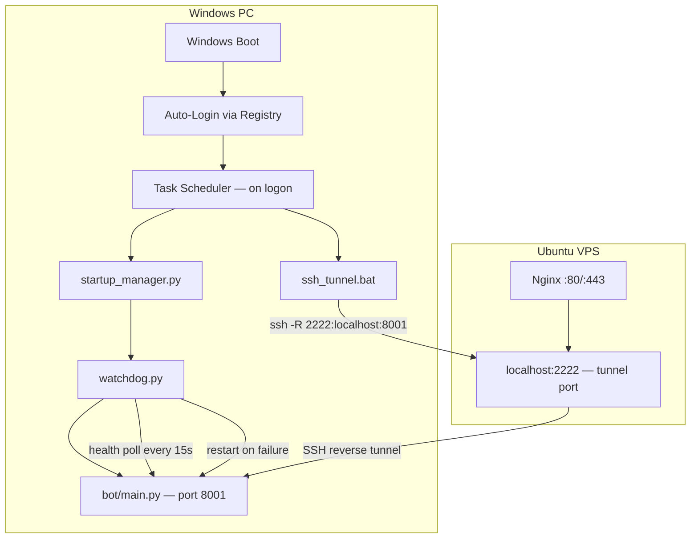

# Design Document — Windows Autostart Server

## Overview

This feature turns the Windows PC running the trading bot into a self-managing, always-on service host. After a one-time setup, the machine boots, logs in automatically, starts the bot API server, keeps it alive via a watchdog, and exposes it to the remote VPS through a persistent SSH reverse tunnel — all without any manual intervention.

The implementation is split into eight deliverables:

| File | Role |
|---|---|
| `watchdog.py` | Process monitor — health-polls the API and restarts it on failure |
| `startup_manager.py` | Boot orchestrator — waits for network, starts watchdog, confirms readiness |
| `start_server.bat` / `stop_server.bat` / `restart_server.bat` | Operator convenience scripts |
| `ssh_tunnel.bat` | Persistent SSH reverse tunnel with auto-reconnect |
| `install_tasks.bat` | Registers both components in Windows Task Scheduler |
| `setup_autologin.bat` | Writes auto-login registry keys |
| `nginx_bot.conf` | VPS Nginx snippet that proxies the tunnel port |

All Python files live in the project root alongside `bot/`. All batch files also live in the project root.

---

## Architecture



**Startup sequence:**

1. Windows boots → auto-login fires → Task Scheduler triggers on logon.
2. `startup_manager.py` waits 60 s for Windows services, checks internet (up to 5 retries), then spawns `watchdog.py` as a detached subprocess.
3. `watchdog.py` launches `bot/main.py --api` and begins polling `GET /health` every 15 s.
4. `ssh_tunnel.bat` runs in parallel, establishing the reverse tunnel and reconnecting automatically on drop.
5. Nginx on the VPS forwards public traffic through the tunnel to port 8001.

---

## Components and Interfaces

### watchdog.py

```
watchdog.py
  ├── Config constants (PYTHON_EXE, BOT_CMD, HEALTH_URL, POLL_INTERVAL, FAIL_THRESHOLD)
  ├── setup_logger() → logging.Logger
  ├── kill_port(port: int) → None          # frees port 8001 before restart
  ├── check_health(url: str, timeout: int) → bool
  ├── run_watchdog() → None                # main loop
  └── __main__ entry
```

Key behaviours:
- Launches `bot/main.py --api` via `subprocess.Popen` using `.ci_probe_0306/Scripts/python.exe`.
- Polls `http://localhost:8001/health` every 15 s.
- Tracks consecutive failures; resets to 0 on any success.
- After 3 consecutive failures **or** subprocess exit: calls `kill_port(8001)`, then re-launches.
- Logs every restart with UTC timestamp, reason, and attempt counter.

### startup_manager.py

```
startup_manager.py
  ├── Config constants (STARTUP_DELAY, CONNECTIVITY_URL, MAX_RETRIES, RETRY_INTERVAL,
  │                     HEALTH_POLL_INTERVAL, HEALTH_TIMEOUT)
  ├── setup_logger() → logging.Logger
  ├── wait_for_internet(url, retries, interval) → bool
  ├── start_watchdog() → subprocess.Popen
  ├── wait_for_health(url, poll_interval, timeout) → bool
  └── main() → None
```

Key behaviours:
- `time.sleep(STARTUP_DELAY)` (default 60 s) before doing anything.
- Checks `https://www.google.com` up to 5 times with 10 s gaps; exits non-zero if all fail.
- Spawns `watchdog.py` as a detached background process (`subprocess.Popen` with `DETACHED_PROCESS` flag on Windows).
- Polls `/health` every 5 s for up to 60 s; logs elapsed time on success, logs timeout warning and exits (leaving watchdog alive) on failure.

### Batch Files

**start_server.bat**
```bat
@echo off
start "TradingBot" /B ".ci_probe_0306\Scripts\python.exe" startup_manager.py
```

**stop_server.bat**
```bat
@echo off
echo Stopping trading bot processes...
taskkill /F /IM python.exe /FI "WINDOWTITLE eq TradingBot*"
taskkill /F /IM python.exe /FI "MEMUSAGE gt 0" 2>nul
echo Done. All bot python.exe processes terminated.
```
(Uses `wmic` or `tasklist` to identify project-specific processes; echoes a list before killing.)

**restart_server.bat**
```bat
@echo off
call stop_server.bat
timeout /t 3 /nobreak >nul
call start_server.bat
```

### ssh_tunnel.bat

```bat
@echo off
set VPS_USER=ubuntu
set VPS_HOST=your.vps.ip
set VPS_PORT=22
set TUNNEL_PORT=2222
set LOCAL_PORT=8001
set KEY_FILE=%USERPROFILE%\.ssh\id_rsa

:loop
ssh -N -R %TUNNEL_PORT%:localhost:%LOCAL_PORT% ^
    -o ServerAliveInterval=30 ^
    -o ServerAliveCountMax=3 ^
    -o ExitOnForwardFailure=yes ^
    -i "%KEY_FILE%" ^
    -p %VPS_PORT% ^
    %VPS_USER%@%VPS_HOST%
echo SSH tunnel exited. Reconnecting in 10 seconds...
timeout /t 10 /nobreak >nul
goto :loop
```

### install_tasks.bat

Registers two tasks via `schtasks /create /F` (the `/F` flag overwrites existing tasks):

- **TradingBotServer** — triggers `startup_manager.py` at logon, `RUNLEVEL HIGHEST`.
- **TradingBotSSHTunnel** — triggers `ssh_tunnel.bat` at logon, `RUNLEVEL HIGHEST`.

Sub-commands: `install_tasks.bat enable|disable|remove <taskname>`.

### setup_autologin.bat

```bat
@echo off
if "%~1"=="" ( echo Usage: setup_autologin.bat USERNAME PASSWORD & exit /b 1 )
if "%~2"=="" ( echo Usage: setup_autologin.bat USERNAME PASSWORD & exit /b 1 )
set KEY=HKLM\SOFTWARE\Microsoft\Windows NT\CurrentVersion\Winlogon
reg add "%KEY%" /v AutoAdminLogon  /t REG_SZ /d 1    /f
reg add "%KEY%" /v DefaultUserName /t REG_SZ /d "%~1" /f
reg add "%KEY%" /v DefaultPassword /t REG_SZ /d "%~2" /f
echo Auto-login configured for user: %~1
echo Please reboot to verify.
```

### nginx_bot.conf

Snippet to include inside an existing `server {}` block on the VPS:

```nginx
location /bot/ {
    proxy_pass         http://localhost:2222/;
    proxy_set_header   Host              $host;
    proxy_set_header   X-Real-IP         $remote_addr;
    proxy_set_header   X-Forwarded-For   $proxy_add_x_forwarded_for;
    proxy_read_timeout 300s;
}
```

---

## Data Models

### Log Entry (both Python components)

Every log record written by `watchdog.py` and `startup_manager.py` follows this structure:

```
{UTC_TIMESTAMP} | {COMPONENT} | {LEVEL} | {MESSAGE}
```

Example:
```
2024-01-15 03:42:11 UTC | watchdog | WARNING | Health check failed (attempt 2/3): ConnectionRefusedError
2024-01-15 03:42:26 UTC | watchdog | ERROR   | Restarting bot (attempt 7) — reason: 3 consecutive health failures
```

Fields:
- `UTC_TIMESTAMP` — `datetime.utcnow()` formatted as `%Y-%m-%d %H:%M:%S UTC`
- `COMPONENT` — literal string `"watchdog"` or `"startup_manager"`
- `LEVEL` — standard Python logging level name (`DEBUG`, `INFO`, `WARNING`, `ERROR`)
- `MESSAGE` — free-form description

### Watchdog State (in-memory)

```python
@dataclass
class WatchdogState:
    process: subprocess.Popen | None = None
    consecutive_failures: int = 0
    restart_count: int = 0
```

### Configuration Constants

```python
# watchdog.py
PROJECT_ROOT   = Path(__file__).parent
PYTHON_EXE     = PROJECT_ROOT / ".ci_probe_0306" / "Scripts" / "python.exe"
BOT_MODULE     = [str(PYTHON_EXE), "-m", "bot.main", "--api"]
HEALTH_URL     = "http://localhost:8001/health"
POLL_INTERVAL  = 15        # seconds between health checks
FAIL_THRESHOLD = 3         # consecutive failures before restart
HEALTH_TIMEOUT = 10        # seconds before a health request times out
LOG_MAX_BYTES  = 10 * 1024 * 1024   # 10 MB
LOG_BACKUP_COUNT = 3

# startup_manager.py
STARTUP_DELAY       = 60   # seconds to wait after login
CONNECTIVITY_URL    = "https://www.google.com"
MAX_RETRIES         = 5
RETRY_INTERVAL      = 10   # seconds between connectivity retries
HEALTH_POLL_INTERVAL = 5   # seconds between readiness polls
HEALTH_TIMEOUT_SECS  = 60  # max seconds to wait for bot to become healthy
LOG_MAX_BYTES        = 5 * 1024 * 1024   # 5 MB
LOG_BACKUP_COUNT     = 2
```

---

## Correctness Properties

*A property is a characteristic or behavior that should hold true across all valid executions of a system — essentially, a formal statement about what the system should do. Properties serve as the bridge between human-readable specifications and machine-verifiable correctness guarantees.*

The Python components (`watchdog.py`, `startup_manager.py`) contain logic that is amenable to property-based testing. The batch files, Task Scheduler registration, registry writes, and Nginx config are infrastructure/configuration artifacts verified by smoke and integration tests.

Property-based tests use **Hypothesis** (the standard PBT library for Python).

---

### Property 1: Restart triggers on exactly 3 consecutive failures

*For any* sequence of health check results where there are 3 or more consecutive failures, the watchdog SHALL trigger a restart. *For any* sequence where the maximum consecutive failure run is fewer than 3, the watchdog SHALL NOT trigger a restart.

**Validates: Requirements 1.3**

---

### Property 2: Failure counter resets to zero after any success

*For any* sequence of health check results that ends with at least one success, the consecutive failure counter SHALL be 0 after processing that sequence.

**Validates: Requirements 1.7**

---

### Property 3: Log entries always contain all required fields

*For any* log event triggered by the watchdog or startup manager (any message text, any log level, any restart attempt number), the resulting log line SHALL contain a UTC timestamp, the component name, the log level, and the message text.

**Validates: Requirements 1.6, 8.3**

---

### Property 4: Startup manager retries connectivity up to 5 times

*For any* sequence of connectivity check results with N failures (0 ≤ N ≤ 5), the startup manager SHALL attempt exactly min(N+1, 5) checks before either proceeding (if a success is found) or exiting with a non-zero code (if all 5 fail).

**Validates: Requirements 2.2, 2.3**

---

### Property 5: Readiness polling respects the 60-second timeout

*For any* sequence of health poll results where the first success occurs at poll index K, the startup manager SHALL log the elapsed time as approximately K × 5 seconds and SHALL NOT poll beyond the 60-second window (i.e., K ≤ 12).

**Validates: Requirements 2.5, 2.6**

---

## Error Handling

### watchdog.py

| Scenario | Handling |
|---|---|
| `subprocess.Popen` fails (e.g., bad path) | Log `ERROR`, sleep 15 s, retry |
| `kill_port` fails (no process on port) | Log `DEBUG`, continue with restart |
| Health request raises `requests.Timeout` | Count as one failure; log `WARNING` |
| Health request raises `ConnectionError` | Count as one failure; log `WARNING` |
| Health response is non-2xx | Count as one failure; log `WARNING` with status code |
| Subprocess exits with non-zero code | Log exit code, trigger immediate restart |
| Keyboard interrupt / SIGTERM | Log `INFO "Watchdog shutting down"`, terminate child process, exit cleanly |

### startup_manager.py

| Scenario | Handling |
|---|---|
| All 5 connectivity checks fail | Log `ERROR`, `sys.exit(1)` |
| `subprocess.Popen` for watchdog fails | Log `ERROR`, `sys.exit(1)` |
| Health timeout (60 s) | Log `WARNING "Bot did not become healthy in time"`, exit 0 (watchdog keeps running) |
| Keyboard interrupt during startup delay | Log `INFO`, exit cleanly |

### ssh_tunnel.bat

| Scenario | Handling |
|---|---|
| SSH exits for any reason | `timeout /t 10`, then `goto :loop` |
| Port already in use on VPS | `ExitOnForwardFailure=yes` causes immediate exit → reconnect loop handles it |
| Key file missing | SSH exits with error → reconnect loop retries (operator must fix key) |

---

## Testing Strategy

### Unit Tests (pytest)

Located in `tests/test_watchdog.py` and `tests/test_startup_manager.py`.

Focus areas:
- Correct subprocess launch arguments (venv python path, `--api` flag).
- `kill_port` calls the right system commands.
- Log file handler is configured with correct `maxBytes` and `backupCount`.
- Startup manager exits non-zero when all connectivity checks fail.
- Startup manager logs elapsed time on successful health confirmation.
- Startup manager logs timeout warning and does not kill watchdog on health timeout.

### Property-Based Tests (Hypothesis, minimum 100 iterations each)

Located in `tests/test_watchdog_properties.py` and `tests/test_startup_manager_properties.py`.

Each test is tagged with a comment referencing the design property:
```python
# Feature: windows-autostart-server, Property 1: Restart triggers on exactly 3 consecutive failures
```

**Property 1 test** — `@given(st.lists(st.booleans(), min_size=1))`: feed health result sequences into the failure-counter logic, assert restart fires iff max consecutive False run ≥ 3.

**Property 2 test** — `@given(st.lists(st.booleans(), min_size=1).filter(lambda s: True in s))`: feed sequences ending in True, assert counter is 0 after processing.

**Property 3 test** — `@given(st.text(), st.sampled_from(["DEBUG","INFO","WARNING","ERROR"]), st.integers(min_value=0))`: call the log-formatting function, assert all four fields appear in the output string.

**Property 4 test** — `@given(st.integers(min_value=0, max_value=5))`: simulate N failures then a success (or N=5 all failures), assert attempt count and exit behaviour match spec.

**Property 5 test** — `@given(st.integers(min_value=0, max_value=12))`: simulate success at poll index K, assert logged elapsed time ≈ K × 5 s and no polls beyond index 12.

### Smoke Tests (manual / CI script)

- Inspect each batch file for required flags and commands (grep-based checks).
- Verify `nginx_bot.conf` contains all required directives.
- Verify `setup_autologin.bat` uses `%~1` / `%~2` parameters and not hardcoded credentials.

### Integration Tests (Windows environment only)

- Run `install_tasks.bat` and verify tasks appear in `schtasks /query` output.
- Run `setup_autologin.bat` with test credentials and verify registry values via `reg query`.
- Apply `nginx_bot.conf` on VPS, run `nginx -t`, reload, and send a test request through the tunnel.
